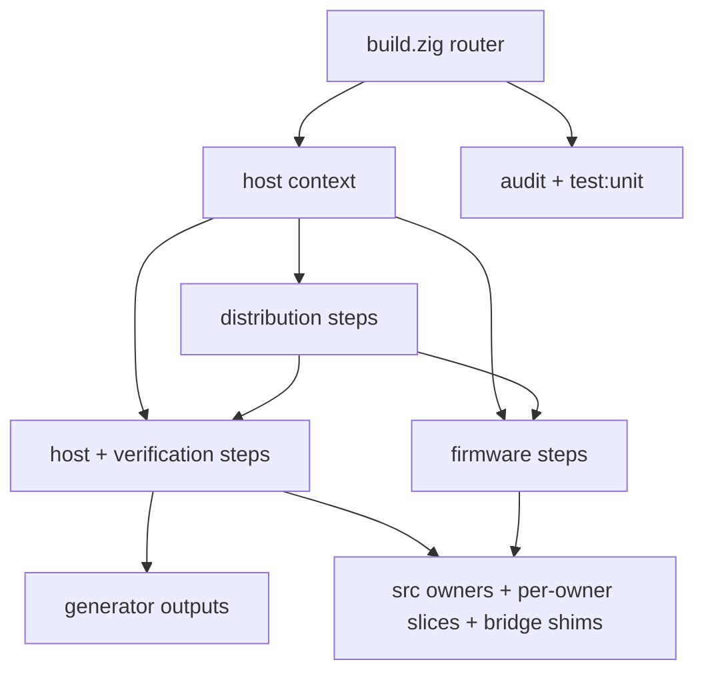

# Zig Build Graph

This page explains how the repo-root `build.zig` routes work into five build
domains: host, firmware, distribution, generators, and tests/verification. It is
the architecture view of `build/` -- the structure of the domains and how
top-level steps map onto them.

Read [10-build-and-source-layout.md](10-build-and-source-layout.md) first. This
page assumes the entrypoints, pins, and output paths are already clear. For the
flat list of maintainer entrypoints, see page 10 and the live
`zig build --help`; this page does not repeat that list.

Last verified: 2026-10-05, Zig `0.17.0` stable. The upstream pin is
`UPSTREAM_COMMIT` in `../.github/project/upstream-pin.env`.

## Router Contract

The repo-root `../build.zig` is intentionally small. It parses options and wires
the domains together. Apart from the `pure_modules` list behind `test:unit`, it
owns no source lists, platform glue, or packaging logic.

Its current top-level responsibilities, in order, are:

1. register the C-dependency audit steps (`check-c-deps*`)
2. register the native Zig unit-test step (`test:unit`)
3. parse the project-specific options
4. create the shared host context through `build/host.zig`
   (`prepareContext`)
5. register host steps (`host.zig` -> `host/steps.zig`)
6. register firmware steps (`firmware.zig`)
7. register the `object-manifest` step (`../build/object_manifest.zig`), which
   declares the linked object sets of `sim`, `dmcp` and `dmcp5` for the
   object-graph gate
8. resolve the distribution version, then register distribution steps
   (`dist.zig`)

`check-c-deps*`, `test:unit`, and `object-manifest` are self-contained and are
registered directly in `../build.zig`; every other public step is registered
inside its domain module. `object-manifest` has to live here because it asks the
BUILD for each product's object set rather than inferring it from a cache glob or
a name prefix, which is where every wrong object-set number came from.

## Domain Split

`build/` is organized into the five domains this page describes, plus the
Zig HAL replacements that stand in for upstream C and the per-owner
build-registration slices shared by the host and firmware domains.

| Surface | Domain / role |
| --- | --- |
| `../build.zig` | option parsing, root orchestration, `check-c-deps*`, `test:unit` and `object-manifest` |
| `../build/common.zig` | shared helpers, C flag tables, upstream-path resolution, the configure-time host-read helpers, and `addTranslator` (the `translate_c` package dependency in `../build.zig.zon`) |
| `../build/object_manifest.zig` | the `object-manifest` writer wiring |
| `../build/abi_host.zig` | the single host object that holds the core-to-shell hook storage |
| `../build/host.zig` | stable facade for host context creation and host step registration |
| `../build/host/context.zig` | host context creation, source resolution, generated-output setup |
| `../build/host/generated.zig` | version-header and generator output integration |
| `../build/host/builders.zig` | simulator and host test/parity executable builders |
| `../build/host/steps.zig` | public host, generator, docs, clean, and verification steps |
| `../build/host/platform.zig` | GTK, FreeType, Windows pkg-config, and system path glue |
| `../build/host/gtk_*.zig` | Zig GTK 3 host layer that replaces the imported `../upstream/src/c47-gtk` C |
| `../build/firmware.zig` | firmware orchestration, SDK integration, CRC helper, cross-GMP bootstrap |
| `../build/firmware_*_runtime.zig` | Zig DMCP/DMCP5 HAL (audio, file I/O, print IR, console) that replaces the upstream firmware C. The console sinks are not cosmetic: defining them is what keeps newlib's buffered stdio (`findfp.o` and its `FILE` array in SRAM2) out of the firmware link |
| `../build/firmware/` | `discard_exidx.ld`, the linker fragment applied before the board script |
| `../build/dist.zig` | host and firmware distribution step registration |
| `../build/zig_dist.py` | Python packaging helper used by the Zig distribution steps |
| `../build/tools/` | Zig-owned deterministic generator entrypoints (constants, catalogs, testPgms, fonts, reserved-register lookup, object-manifest writer) plus the `translate_c` root headers and the `size.py` / `xlsx_to_sorting_csv.py` helpers |
| `../build/tests/` | parity oracles, fake runtimes, harnesses, and `testsuite_hal.zig` (the Zig testSuite HAL that replaces the imported `../upstream/src/testSuite/hal/*.c`). All of z47's first-party `.c` files live here; the only other first-party C is the `../bridge/` headers and the `translate_c` root headers |
| `../build/generated/` | z47's tracked `testPgms.bin` |
| `../build/{constants,shortint,state,mathematics,frontier,solver,ui}/` | per-owner build registration that wires the `src/` owners into both the host and firmware builds |
| `../src/` | the ported calculator core (the live Zig owners) |
| `../bridge/` | near-retired legacy header shims paired with a few owners |

The Zig HAL replacements (`host/gtk_*.zig`, `firmware_*_runtime.zig`,
`tests/testsuite_hal.zig`) are compiled and linked in place of the corresponding
upstream C. The retained third-party C -- vendored `upstream/dep/decNumberICU`,
compiled by Zig for the host and by `arm-none-eabi-gcc` in the firmware link, plus
external GTK 3, GMP, FreeType 2, optional PulseAudio (host), and a cross-built
GMP 6.2.1 and the SwissMicros DMCP/DMCP5 SDKs (firmware) -- is still linked by
these domains; see
[00-project-and-upstream.md](00-project-and-upstream.md) and
[50-zig-c-boundaries-and-rewrite-policy.md](50-zig-c-boundaries-and-rewrite-policy.md).

## Build Graph Shape

## Top-Level Steps By Domain

The public steps group onto the domains as follows. See page 10 for the flat
entrypoint list and `zig build --help` for the authoritative set.

| Domain | Registered in | Step groups |
| --- | --- | --- |
| Host simulators | `host/steps.zig` | `sim`/`all`, `simr47`, `both`, `both_asan`, `simulator_smoke` |
| Generators | `host/steps.zig` (driving `tools/`) | `fonts`, `constants`, `catalogs`, `testpgms`/`testPgms`, `generated` |
| Docs and cleanup | `host/steps.zig` | `docs`, `clean` |
| Tests and verification | `host/steps.zig` (driving `tests/`) and `build.zig` | grouped host lanes `test`, `test_asan`, `repeattest`; native `test:unit`; the `pgm_load_fuzz` and `state_load_fuzz` malformed-input load lanes; C-dependency audits `check-c-deps*`; `object-manifest` (in `build.zig`); the per-owner `*_parity` suites, `*_oracle` helpers, and focused regression/harness lanes |
| Firmware | `firmware.zig` | `dmcp`, `dmcpr47`, `dmcp5`, `dmcp5r47`, the fixed-package `dmcp_pkg1`/`2`/`3`, and `dmcp_pkgs_all` |
| Distribution | `dist.zig` | host `dist_linux`/`dist_macos`/`dist_windows`, firmware `dist_dmcp*`, the `dist_dmcp_pkgs_*` bundles, and the aggregate `dist`/`distS` |

The firmware step names `dmcp`, `dmcpr47`, `dmcp5`, `dmcp5r47` and `dmcp_pkg<n>`
come from `Config` values in `firmware.zig` and reach `b.step` through
`addFirmwareBuild`, so a grep for `b.step("` finds only `dmcp_pkgs_all`;
`dist.zig` registers the `dist_dmcp*` steps the same way.

## Project-Specific Options

`zig build --help` lists these project-specific options; the defaults are the
`orelse` values in `../build.zig`:

- `-Doptimize=<debug|safe|fast|small>`
- `-Dci-commit-tag=<string>`
- `-Draspberry=<bool>` (default `false`)
- `-Ddecnumber-fastmul=<bool>` (default `true`)
- `-Ddmcp-package=<int>` (default `4`)
- `-Dpgm=<string>` (registered in `../build/host/steps.zig`, read by `pgm_run`)

`dmcp` and `dmcpr47` use `-Ddmcp-package` with a default value of `4`. Dedicated
fixed-package steps exist for package variants `1`, `2`, and `3`.

## Generated Output Wiring

The host context wires deterministic generator outputs back into tracked files.
The public update steps are implemented in `../build/host/steps.zig` and copy
generator output back to source-controlled locations through
`addUpdateSourceFiles()`.

That contract keeps the tracked generated calculator sources and generated
test-program data under explicit Zig build ownership instead of ad hoc scripts.

## Version And Packaging Metadata

`../build.zig` resolves the package version from the explicit `-Dci-commit-tag`
option when present and otherwise falls back to
`git describe --match=NeVeRmAtCh --always --abbrev=8 --dirty=-mod`, then hands the
result to `dist.zig`. `../build/host/generated.zig` derives the simulator's own
version header from the same fallback.

That fallback is a z47 packaging convenience. It does not replace the separate
checked-in upstream pin under `../.github/project/upstream-pin.env`.

## Configure-Time Inputs

`zig build` caches the configuration `build.zig` produces, keyed on the command
line, the target triple and the build sources. Anything else the configure logic
reads from the host is invisible to that key, so a cached configuration would
keep the `git describe` stamp, the date and the pkg-config answers from the run
that produced it. Every such read goes through a helper in `../build/common.zig`:

- `commandOutput` and `pkgConfigExists` run a process, `hostEnv` reads an
  environment variable, and `hostFileExists` checks a path. Each poisons the
  configure cache, so `zig build` configures again on every run.
- `collectRelativeCFiles` walks a source tree and declares every directory it
  lists with `dependOnDirectoryContents`, so adding, removing or renaming a file
  reconfigures without poisoning anything.

`zig build <step> --cache-poison=disallowed` panics at the first poisoning call
with its stack trace, which is how to find out what keeps a configuration from
being cached.

## Change Rules

- Keep `../build.zig` as a thin router. Push domain-specific logic down into the
  matching `build/` domain module.
- Add or rename public steps in one place, then update `../README.md`, the
  page 10 entrypoint list, `docs/`, and any affected workflow or packaging
  code in the same change.
- Keep new platform-specific behavior centralized in `../build/host/` or
  `../build/firmware.zig`, not scattered through the tree.
- Read the host while configuring only through the `../build/common.zig`
  helpers listed under Configure-Time Inputs, never through
  `b.graph.environ_map`, `std.process.run` or a filesystem call of your own.
- Derive a build fact from an option the caller passed, never from the name of a
  target or step. A name-derived fact and the real one can disagree with nothing
  to notice, as `is_testsuite_build` and `-DTESTSUITE_BUILD` once did.
- A destructive step inherits upstream's vocabulary along with its behaviour:
  `zig build clean` ported upstream's `rm -rf build` and deleted z47's own
  `build/`. `check-clean-step-targets.py` (gate step 6g1) refuses a destructive
  step that targets a z47-owned root; after any rename, grep the destructive
  commands again.
- Add new parity oracles, fake runtimes, or harnesses under
  `../build/tests/` and register their steps in `../build/host/steps.zig`.
- Do not move imported upstream compatibility helpers such as `../upstream/tag2ver.py`
  just to make the Zig layout look cleaner. The imported legacy build graph still
  references them.
