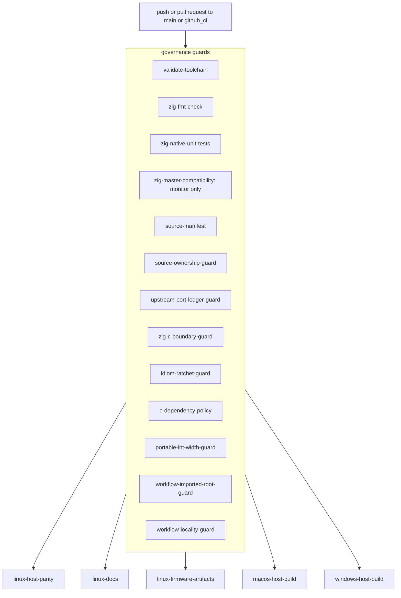

# CI And Release Workflow

This page explains the GitHub Actions lane split for z47: the governance guards
and platform jobs each workflow runs, which artifacts and release proofs it
publishes, and how to reproduce the same Linux verdict locally.

Read [10-build-and-source-layout.md](10-build-and-source-layout.md) first. This
page assumes the build entrypoints and output paths are already clear.

Audit basis: 2026-07-10, upstream pin `0caee2adc`, Zig `0.16.0` stable.

## CI At A Glance

Three tracked workflow files live under `../.github/workflows/`:

| Workflow file | Trigger | Purpose |
| --- | --- | --- |
| `upstream-oracle.yml` (display name `host-platform-parity`) | push and pull request targeting `main` or `github_ci`, plus manual dispatch | the main matrix: governance guards plus the Linux, macOS, and Windows host lanes, the Linux docs and firmware lanes, and a monitored Zig-master compatibility probe |
| `upstream-drift.yml` (display name `upstream-drift`) | daily schedule `0 5 * * *`, plus manual dispatch | report whether the pinned upstream commit still matches upstream HEAD, plus a coverage ratchet; reporting-only, never edits the pin |
| `c-dependency-zero.yml` (display name `c-dependency-zero`) | manual dispatch only | on-demand proof that the product build carries zero first-party calculator C |

The concurrency group cancels superseded runs per branch and repository. The
main matrix runs with `permissions: contents: read` only.

## Workflow Graph

`upstream-oracle.yml` fans every governance guard out from the push or pull
request event in parallel, then gates each platform job on the subset of guards
it declares in `needs`.



Platform-job gating is not uniform. Each platform job waits only on the guards
it lists:

| Platform job | `needs` (guard gate) |
| --- | --- |
| `linux-host-parity` | validate-toolchain, source-manifest, source-ownership-guard, upstream-port-ledger-guard, zig-c-boundary-guard, c-dependency-policy, workflow-imported-root-guard, workflow-locality-guard |
| `linux-firmware-artifacts` | same eight as `linux-host-parity` |
| `linux-docs` | validate-toolchain, upstream-port-ledger-guard, workflow-imported-root-guard, workflow-locality-guard |
| `macos-host-build` | validate-toolchain, source-manifest, source-ownership-guard, upstream-port-ledger-guard, zig-c-boundary-guard, c-dependency-policy, workflow-imported-root-guard |
| `windows-host-build` | same seven as `macos-host-build` |

`zig-fmt-check`, `zig-native-unit-tests`, `idiom-ratchet-guard`,
`portable-int-width-guard`, and `zig-master-compatibility` gate no platform job;
they run purely as their own required checks (except the compatibility monitor,
which is `continue-on-error`).

## Shared CI Inputs

The workflow keeps its shared checked-in control data in these files:

- `../.github/zig-toolchain.env`
- `../.github/project/upstream-pin.env`
- `../.github/project/upstream-port-ledger.tsv`
- `../.github/project/report-upstream-refresh.py`
- `../.github/project/source-ownership.txt`
- `../.github/project/workflow-imported-root-paths.sh`
- `../.github/project/zig-c-boundaries.txt`
- `../.github/project/idiom-status-baseline.json`
- `../.github/project/portable-int-width-allowlist.txt`
- `../upstream/docs/code/requirements.txt`

The Linux docs lane caches the Python package download directory keyed by the
helper-resolved docs requirements file. The host platform jobs and the Linux
firmware lane resolve the current upstream HEAD of the xlsxio helper repository
and use that SHA in their cache keys (schema-versioned by the manual
`XLSXIO_HELPER_CACHE_VERSION`), so unrelated CI YAML edits no longer force helper
rebuilds. The Linux host/docs/firmware and macOS lanes also restore lane-scoped
Zig build caches through `actions/cache` (schema-versioned by
`ZIG_BUILD_CACHE_VERSION`).

The workflow imported-root guard uses
`../.github/project/workflow-imported-root-paths.sh` as the shared path
vocabulary for docs install, generated-artifact proof, and host package staging.
That keeps the workflow text aligned with `UPSTREAM_ROOT` instead of repeating
repo-root imported paths ad hoc. The upstream-port ledger guard uses
`../.github/project/upstream-port-ledger.tsv` plus
`../.github/project/upstream-pin.env` as the tracked vocabulary for
upstream-refresh triage, so pin movement and explicit z47 follow-up records land
in the same reviewed change.

## Governance Guards

Every guard is a small standalone job with a `contents: read` checkout. Each
maps to a committed script or generator so the same check runs locally.

| Job id | Display name | What it enforces |
| --- | --- | --- |
| `validate-toolchain` | Validate pinned Zig toolchain | verify the pinned Zig version and Linux SHA-256 against `ziglang.org/download/index.json`, install it, and confirm `zig version` |
| `zig-fmt-check` | Enforce zig fmt on z47-owned Zig | run `./.github/project/check-fmt.sh` (`zig fmt --check` over z47-owned Zig) |
| `zig-native-unit-tests` | Native Zig unit tests (no C oracle) | run `zig build test:unit`, the native Zig unit suites with no C oracle |
| `zig-master-compatibility` | Zig master compatibility monitor | install the monitored Zig-master snapshot and run `zig build --help` plus the short-integer parity probes; `continue-on-error: true`, so it reports drift without gating merge |
| `source-manifest` | Verify imported upstream pin and source manifest | confirm the pinned commit is still reachable from `upstream/master`, then upload the `upstream-source-index` manifest built from `source-ownership.txt` |
| `source-ownership-guard` | Verify tracked source ownership | run `check-source-ownership.sh`; reject unapproved added files under imported upstream-shaped roots (fetches the upstream branch first to diff from the merge base) |
| `upstream-port-ledger-guard` | Verify tracked upstream port ledger | run `check-upstream-port-ledger.py`; require a `pin-only` ledger row for the current `UPSTREAM_COMMIT` so a pin move cannot land without a ledger update |
| `zig-c-boundary-guard` | Verify curated Zig/C boundaries | run `check-zig-c-boundaries.sh`; fail if checked-in Zig boundary usage drifts from the approved allowlist |
| `idiom-ratchet-guard` | Enforce idiomatic-Zig ratchet (no transliteration-debt regressions) | run `check-idiom-ratchet.sh` (monotonic idiom ratchet) and `generate-font-seams.py --check` (generated ABI seams still match upstream C) |
| `c-dependency-policy` | Verify Phase I C dependency policy | run `check-c-dependency-phase-i-policy.sh .` |
| `portable-int-width-guard` | Guard against the Windows LLP64 integer-width trap | run `check-portable-int-widths.sh`; reject value-carrying `c_long`/`c_ulong` that would change width under Windows LLP64 |
| `workflow-imported-root-guard` | Verify workflow imported-root vocabulary | run `workflow-imported-root-paths.sh check-workflow`; keep direct repo-root imported-path literals in workflow YAML at zero |
| `workflow-locality-guard` | Verify workflow script locality | run `check-ci-no-local-dev-scripts.sh`; reject `__DEV/` script dependencies in workflow steps |

## Platform Jobs

### `linux-host-parity` (Linux host parity, the `*_asan` lanes, generated outputs, and host package)

This is the blocking full-parity lane. Its core build/test step runs the
committed `../.github/project/run-host-parity-battery.sh` script directly, so CI
and the local gate execute byte-identical steps and cannot drift. That battery
runs, in order:

- the value parity oracles: `logical_shortint_parity`, `rotate_bits_parity`,
  `logical_boolean_ops_suite`, `stack_state_parity`, `register_metadata_parity`
  (retried once for cold-cache flakiness), `flags_parity`, `memory_parity`,
  `program_serialization_parity`, `calc_state_parity`,
  `math_command_wrappers_parity`, `math_random_parity`, `keyboard_state_parity`
- the format-equivalence oracle `format_parity`
- the header-constant audits: `constants` then `check-constant-offsets.py`,
  `audit-constant-parity.py`, `audit-item-table-parity.py`, and the
  `abi-layout-parity` struct-layout oracle
- `both` (both host simulators), then the non-blocking `simulator_smoke`, then
  `testPgms`, `${XVFB} test` (the 10228-test shared testSuite), and `generated`

The job then runs the `*_asan` surface (`both_asan`, `test_asan`, and
`pgm_load_fuzz` -- the malformed `.p47` load corpus driven through the real load
path -- the name is historical: these lanes run UBSan, not AddressSanitizer, see
[75-debugging.md](75-debugging.md)), builds the
published Linux archive with `zig build -Doptimize=ReleaseFast dist_linux`,
launches a smoke test from the unpacked archive, diffs and hashes the tracked
generated artifacts, and uploads the Linux package artifact plus a golden
generated-files-and-hashes artifact. Docs and firmware publication moved to their
own Linux jobs, so this lane no longer installs Doxygen, the Python docs
packages, or Arm GCC.

The headless `simulator_smoke` GUI lane and the packaged-archive launch are
NON-BLOCKING by design: a version-independent pixman SSE2 composite over-read
under Xvfb software rendering trips a SIGSEGV that is not a product regression.
Both steps emit a warning and continue instead of failing.

### `linux-docs` (Linux docs surface)

Installs Doxygen and the Python docs packages from `../upstream/docs/code/requirements.txt`
(caching the pip download directory), runs `zig build docs`, and keeps
docs-only dependencies out of the host and firmware lanes.

### `linux-firmware-artifacts` (Linux firmware validation and publication)

Validates the firmware surface with `zig build dmcp`, `dmcpr47`, `dmcp5`, and
`dmcp5r47`, then publishes through `dist_dmcp`, `dist_dmcp_pkg1`,
`dist_dmcp_pkg2`, `dist_dmcp_pkg3`, `dist_dmcpr47`, `dist_dmcp5`, and
`dist_dmcp5r47`. It stages and uploads the Linux firmware artifact. This lane
carries the Arm GCC dependency that `linux-host-parity` deliberately omits.

### `macos-host-build` (macOS dedicated runner build, test, generated outputs, app smoke run)

Runs on `macos-latest`. It deliberately runs only the macOS-specific subset:
`zig build constants`, `abi-layout-parity`, `both`, `test`, and `generated`. The
platform-independent value oracles and header-constant audits already run on the
blocking Linux lane and compute identical values on every target, so re-running
them here would add minutes for zero extra coverage; only the ABI struct-layout
oracle and the native app build/testSuite have real per-target sensitivity (the
historical dyld SIGBUS class). The job then rebuilds `both` in `ReleaseFast`,
runs a smoke launch from the built simulator, and stages the macOS package
artifact. It installs only missing Homebrew formulae to stay idempotent.

### `windows-host-build` (Windows dedicated runner build, test, generated outputs, app smoke run)

Runs on `windows-latest` under MSYS2 UCRT64 with the same trimmed lane as macOS:
`zig build constants`, `abi-layout-parity`, `both`, `test`, and `generated`,
then a `ReleaseFast` rebuild, a direct smoke launch, and a relocatable Windows
package (GTK runtime assets, launcher files, runtime caches, notice metadata)
with a relocated launcher smoke test before upload. All UCRT64 packages install
in the cached `setup-msys2` step (`release: false`, `update: true`); the notice
generator batches `pacman -Qqo` ownership lookups over the staged runtime tree.
This is the lane that finally adjudicates the Windows LLP64 integer-width
behavior the `portable-int-width-guard` only approximates.

## Artifacts And Release Proof

Current artifact classes:

- `upstream-source-index` source manifest from `source-manifest`
- Linux golden generated-artifact proof (files plus SHA-256) from
  `linux-host-parity`
- packaged simulator artifacts named `z47-linux-<upstream_short>`,
  `z47-macos-<upstream_short>`, and `z47-windows-<upstream_short>` (the short is
  the first 12 chars of `UPSTREAM_COMMIT`)
- the Linux firmware artifact `z47-firmware-<upstream_short>` from
  `linux-firmware-artifacts`, containing `c47-dmcp.zip`, `c47-dmcp-pkg1.zip`,
  `c47-dmcp-pkg2.zip`, `c47-dmcp-pkg3.zip`, and `c47-dmcp5.zip`
- the `upstream-drift` report artifact from the scheduled drift workflow

The published desktop host artifacts stage `ReleaseFast` simulator binaries, and
`build/common.zig` resolves x86/x86_64 host-package targets to a baseline CPU
model rather than runner-native features. Linux packaging stages build metadata,
source provenance, and a runtime notice inventory; Windows packaging additionally
records staged GTK runtime directories, tools, launcher files, and DLL notices.

## Local Reproduction Map

The full Linux CI verdict reproduces with one command before pushing:

```bash
bash .github/project/run-local-gate.sh
```

It runs the governance-check scripts CI runs as separate guard jobs (fmt,
`test:unit`, source ownership, upstream/port ledger, Zig/C boundaries, idiom
ratchet, Phase I C dependency, workflow locality, portable int widths), then the
`run-host-parity-battery.sh` battery (byte-identical to the `linux-host-parity`
build/test step), then the tracked generated-artifact diff. It fails fast on the
first red. It cannot reproduce the macOS lane or the Windows LLP64 runtime
adjudication; those stay CI-only.

For a narrower rerun that matches a single workflow slice:

| Workflow slice | Smallest local reproduction |
| --- | --- |
| full Linux verdict | `bash .github/project/run-local-gate.sh` |
| Linux host parity battery | `bash .github/project/run-host-parity-battery.sh` (set `XVFB="xvfb-run --auto-servernum"` when headless) |
| toolchain pin | `zig version` plus a read of `../.github/zig-toolchain.env` |
| zig fmt guard | `bash .github/project/check-fmt.sh` |
| native unit tests | `zig build test:unit` |
| source manifest or upstream pin | `. ./.github/project/upstream-pin.env && git fetch --no-tags "$UPSTREAM_REPOSITORY_URL" "$UPSTREAM_BRANCH" && git merge-base --is-ancestor "$UPSTREAM_COMMIT" FETCH_HEAD && python3 .github/project/check-upstream-port-ledger.py --repo-root . && bash .github/project/check-source-ownership.sh` |
| Zig/C boundary guard | `bash .github/project/check-zig-c-boundaries.sh` |
| idiom ratchet guard | `bash .github/project/check-idiom-ratchet.sh` |
| Phase I C dependency policy | `bash .github/project/check-c-dependency-phase-i-policy.sh .` |
| Windows LLP64 int-width guard | `bash .github/project/check-portable-int-widths.sh` (approximation; the CI Windows lane is the adjudicator) |
| workflow imported-root contract | `bash .github/project/workflow-imported-root-paths.sh check-workflow` |
| workflow script locality | `bash .github/project/check-ci-no-local-dev-scripts.sh` |
| Linux docs | `zig build docs` |
| Linux firmware | `zig build dmcp && zig build dmcpr47 && zig build dmcp5 && zig build dmcp5r47` |
| Linux firmware publication | `zig build dist_dmcp && zig build dist_dmcp_pkg1 && zig build dist_dmcp_pkg2 && zig build dist_dmcp_pkg3 && zig build dist_dmcpr47 && zig build dist_dmcp5 && zig build dist_dmcp5r47` |
| host package | the matching `dist_<host>` target on the matching host OS; use `-Doptimize=ReleaseFast` for the published desktop archive size contract |

See [70-tests-and-verification.md](70-tests-and-verification.md) for the
per-owner parity lanes and the smallest rerun lane per change class.

## Upstream Drift Workflow

`../.github/workflows/upstream-drift.yml` runs daily and on manual dispatch. Its
`drift` job runs `report-upstream-refresh.py --fetch`, compares the fetched
upstream head with the checked-in `UPSTREAM_COMMIT`, emits a workflow warning
when the pin has moved or diverged, and uploads the `upstream-drift` report
artifact. The workflow also carries a `coverage-ratchet` job
(`check-coverage-ratchet.sh`) and reuses the `zig-c-boundary-guard`. It is
reporting-only and never auto-updates the pin.

## On-Demand C-Dependency-Zero Workflow

`../.github/workflows/c-dependency-zero.yml` is manual-dispatch only. It runs
`zig-c-boundary-guard`, then a `c-dependency-zero` job that enforces a zero
first-party-C cap (`check-c-dependency-allowlist.py --max-first-party 0`) and
self-tests the product C-link isolation checker.

## CI Change Rules

- Keep the lane split explicit. Do not hide fmt, docs, firmware, package, and
  boundary validation behind one generic step.
- Keep the Linux host-parity battery in `run-host-parity-battery.sh` so CI and
  `run-local-gate.sh` cannot diverge.
- Keep docs-only and Arm-toolchain dependencies out of `linux-host-parity`
  unless that lane consumes them directly again.
- Keep the macOS and Windows lanes trimmed to the per-target-sensitive checks;
  do not re-add the platform-independent value oracles they intentionally drop.
- Leave the non-blocking `simulator_smoke` and packaged-launch steps as warnings,
  not failures; the Xvfb pixman over-read is not a product bug.
- Keep the shared pins in the checked-in files listed above.
- Keep logs and artifacts uploadable even when a later verification step fails.
- Update this page when job ids or display names, artifact names, trigger
  branches, or local reproduction commands change.
