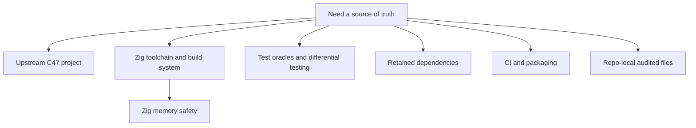

# Official References

This page groups the canonical external and repo-local references that back the
maintainer docs and the checked-in z47 workflow.

Prefer these exact surfaces over broad summaries or secondary writeups.

Audit basis: 2026-08-01, upstream pin `6559a9c59`, Zig `0.16.0` stable. The
Zig memory-safety reference set was reviewed against upstream Zig on that date.
The test-oracle reference set was added and verified 2026-08-03: until then every
reference here was about *writing* the program and none was about *knowing
whether it is right*. It was extended from five sources to eight the same day,
because the first five cover *what an oracle is* and not *what a test environment
is*; the admission test that governs any further addition is at the end of that
section.

## Reference Map

## Upstream Project Surfaces

- [C47 GitLab project](https://gitlab.com/rpncalculators/c43): authoritative
  upstream source repository consumed by z47. The path still uses the
  historical `c43` name even though the project identifies itself as C47.
- [BUILD.md](../upstream/BUILD.md): imported upstream build-target summary carried at
  the repo root.
- [Makefile](../upstream/Makefile): imported upstream human-facing command surface.
- [meson.build](../upstream/meson.build): imported upstream root build graph.
- [dep/meson.build](../upstream/dep/meson.build): imported upstream dependency build
  wiring.
- [src/c47/meson.build](../upstream/src/c47/meson.build): imported upstream main core
  build inputs.
- [src/c47-gtk/meson.build](../upstream/src/c47-gtk/meson.build): imported upstream GTK
  simulator build inputs.
- [src/c47-dmcp/meson.build](../upstream/src/c47-dmcp/meson.build): imported upstream
  DMCP build inputs.
- [src/c47-dmcp5/meson.build](../upstream/src/c47-dmcp5/meson.build): imported upstream
  DMCP5 build inputs.
- [docs/code/meson.build](../upstream/docs/code/meson.build): imported upstream code-doc
  build inputs.
- [subprojects/gmp-6.2.1.wrap](../upstream/subprojects/gmp-6.2.1.wrap): imported GMP wrap
  reference.

## Companion Upstream-Behaviour Doc Set

[c47-r47-ci](https://github.com/ppigazzini/c47-r47-ci) is the CI and test harness
for upstream C47/c43, and its `docs/` set is the maintained description of **the
product z47 ports** -- the C architecture, its memory model and its detectors.
z47 does not restate what that set owns; it links to it. Read it when the
question is "what does the calculator do, and why is the C shaped this way",
and read this set when the question is "how does the Zig port build, verify and
diverge".

| Their page | Owns, for z47's purposes |
| --- | --- |
| `docs/00-architecture.md` | the god header, the item table, the HAL, and the measured upstream dependency graph. Sections 9-11 are assessment and an unadopted proposal, not a plan of record |
| `docs/01-codebase.md` | the upstream source tree, the register file and memory model, and control flow from a key press to a screen |
| `docs/02-modules.md` | the subsystem inventory, each named by its literature term |
| `docs/04-testing.md` | the corpus, the three drivers, and the rules for writing a test that actually tests. z47 shares the corpus, so its authoring rules apply here unchanged |
| `docs/05-debugging.md` | the detectors z47 does not own: the pool canary (`POOL_GUARD`), pool and GMP leak scanning, Valgrind, coverage floors, Frama-C Eva, and the nesting-depth lane |
| `docs/06-memory.md` | the per-platform memory limits: the arenas, the DM42 stacks, what one nested engine level costs, and why a simulator run cannot answer a DM42 question |
| `docs/09-glossary.md` | the calculator's own vocabulary. [95-glossary.md](95-glossary.md) owns z47's |

The two sets are not gated against each other. Treat a number quoted across the
boundary as provenance, not as a live value, and re-derive it on the side that
owns it.

## Zig Toolchain And Build System

The pinned baseline is Zig `0.16.0` stable; the exact version, release date, and
checksum are recorded in [.github/zig-toolchain.env](../.github/zig-toolchain.env).

- [Zig download page](https://ziglang.org/download/): canonical release entry
  point.
- [Zig download index JSON](https://ziglang.org/download/index.json): canonical
  machine-readable release metadata used by the CI toolchain check.
- [Zig build system docs](https://ziglang.org/learn/build-system/): official
  build-system reference.
- [Zig C Translation CLI docs](https://ziglang.org/documentation/master/#C-Translation-CLI):
  official `translate-c` reference and limits.
- [Zig source repository](https://codeberg.org/ziglang/zig): canonical upstream
  Zig source tree.
- [README.md](../README.md): maintained z47 root entry point, command, and
  prerequisite summary.
- [CONTRIBUTING.md](../CONTRIBUTING.md): maintained contributor workflow and
  verification contract.
- [build.zig](../build.zig): live repo-root build router for this repository.

## Zig Memory-Safety References (primary)

Reviewed 2026-08-01. These are the sources the memory-safety posture in
[50-zig-c-boundaries-and-rewrite-policy.md](50-zig-c-boundaries-and-rewrite-policy.md)
is argued from. Read them as *what the toolchain does and does not give you* --
each entry ends with why it does or does not apply to a `ReleaseSmall`
freestanding calculator whose data lives in one static pool.

Language and toolchain:

- [Zig language reference -- Undefined Behavior](https://ziglang.org/documentation/master/#Undefined-Behavior):
  the canonical list of what is checked illegal behaviour (a panic in the safe
  modes) versus unchecked (silent in every mode). This is the authority for
  which of z47's 5628 `@intCast` sites are a trap on the host and a silent
  truncation on the device.
- [Zig 0.16.0 release notes](https://ziglang.org/download/0.16.0/release-notes.html):
  the pinned baseline. Safety-relevant changes: *forbid trivial local addresses
  returned from functions* (now a compile error, "returning address of expired
  local variable"), *forbid runtime vector indexes*, *forbid pointers in packed
  structs and unions*, *forbid unused bits in packed unions*, safe stack
  unwinding by default, and `heap.ThreadSafeAllocator` removed in favour of
  allocators that are lock-free themselves.
- [zig.guide -- Runtime Safety](https://zig.guide/language-basics/runtime-safety/):
  the per-build-mode table of which checks are live. The practical statement of
  why `ReleaseSmall` firmware is unchecked.

Allocator-level safety:

- [ziglang/zig#31186](https://codeberg.org/ziglang/zig/issues/31186): makes
  `DebugAllocator` and `ArenaAllocator` lock-free and thread-safe and deletes
  `ThreadSafeAllocator`; also the tracking issue for the planned
  `DebugAllocator` -> `SafeAllocator` rename with a ReleaseSafe-suitable
  configuration. `SafeAllocator` does not exist in 0.16 -- do not write it into
  a plan.
- [ziglang/zig#25978](https://github.com/ziglang/zig/issues/25978):
  `std.heap.DebugAllocator` with `.safety = true` is broken on **freestanding**
  targets. This rules out the otherwise-obvious "put a checking allocator on the
  device" move, independently of the flash cost.
- [AddressSanitizer manual poisoning](https://github.com/google/sanitizers/wiki/AddressSanitizerManualPoisoning):
  **Read the caveat first: z47 has no AddressSanitizer.** Zig 0.16 ships no ASan
  runtime and `-fsanitize=address` fails to link, so this API has nothing to talk
  to today; it is kept as the reference for what linking a system runtime would
  buy. See [75-debugging.md](75-debugging.md).
  `__asan_poison_memory_region` / `__asan_unpoison_memory_region`, the API that
  makes a custom arena visible to ASan. Chunks must be 8-aligned; C47 blocks are
  4 bytes, so a poisoning implementation must work in 8-byte shadow granules and
  accept that a 4-byte overrun into the next block's first word is not
  detectable. This is the only route to a detector for gap 2 in the posture.

What Zig does not give you:

- [How (memory) safe is Zig? (Jamie Brandon)](https://www.scattered-thoughts.net/writing/how-safe-is-zig/):
  the reference statement of the boundary. Zig catches bounds, null, tag
  confusion, overflow and alignment; it does **not** catch use-after-free,
  iterator invalidation, or interior-pointer invalidation. All three of those are
  live in a design that hands out indices into a relocatable pool, which is
  exactly what `freeListRealloc` does.
- [ziglang/zig#36237](https://codeberg.org/ziglang/zig/issues/36237): the
  accepted proposal (opened 2026-07-20) for a Fil-C-inspired memory-safe
  compilation mode -- a new "fil" ABI with pointer capabilities, no escape
  hatches, and no source changes required. **Not applicable to z47 and unlikely
  to become so**: it is defined for x86_64-linux only, the device is ARM
  freestanding, every linked object must use the same ABI (z47 links GMP,
  decNumber, GTK and the DMCP SDK), and the estimated 1-6x overhead is priced for
  a server, not a calculator. Track it for the host test lane only, and do not
  let a roadmap depend on it.

## Test Oracle And Differential-Testing References

Verified 2026-08-03. These are the external basis for the rule in
[70-tests-and-verification.md](70-tests-and-verification.md) that *an oracle must
be compiled from c43 source*, and for the classification of every check kind in
the tree. They sit here, before the style references, because they are a
**verification** reference set: the idiom ratchet has TigerStyle as a calibrated
external yardstick, and until this section existed the parity lanes — which are
the entire basis of z47's correctness claim — had none.

Domain match (which yardstick applies): z47 is a **port**, so its correctness
claim is function parity with a reference implementation that keeps moving.
**Barr et al. is the primary calibration for the taxonomy** (what kinds of oracle
exist and what each is worth) and **McKeeman is the primary calibration for the
technique** (a `*_parity` lane *is* differential testing, named). Knight & Leveson
is primary for one specific question — why a hand-written oracle fails silently.
Meszaros and *Software Engineering at Google* are primary for a second question
the first five do not reach: not *what an oracle is*, but **what a test
environment is**, and why a lane with a sound reference can still measure nothing.
The rest are secondary: they name check kinds z47 already has.

Primary — the taxonomy:

- [Barr, Harman, McMinn, Shahbaz, Yoo — "The Oracle Problem in Software Testing:
  A Survey", IEEE TSE 41(5):507–525, 2015](https://dl.acm.org/doi/10.1109/TSE.2014.2372785)
  ([UCL open access](https://discovery.ucl.ac.uk/id/eprint/1471263/)): the
  canonical survey. Names the problem — distinguishing correct from incorrect
  behaviour with no independent authority — and gives the four-way split
  (specified / derived / implicit / no oracle) that the mapping table below is an
  instance of.

Primary — the technique:

- [McKeeman — "Differential Testing for Software", Digital Technical Journal
  10(1):100–107, 1998](https://www.cs.tufts.edu/comp/150FP/archive/bill-mckeeman/DifferentailTesting.pdf):
  the original naming of exactly what a `*_parity` lane is. z47 has been doing
  differential testing against a reference implementation since M3.3; this is the
  term for it.

Primary — why the frozen oracles failed the way they did:

- [Knight & Leveson — "An Experimental Evaluation of the Assumption of
  Independence in Multiversion Programming", IEEE TSE 12(1),
  1986](https://www.csc.kth.se/utbildning/kth/kurser/DA2210/vettig13/Seminarier/KnightLeveson.pdf):
  27 independently written versions from one specification, one million inputs;
  common-mode failures far above the independence prediction, the hypothesis
  rejected at 99% confidence. A differential test's power comes entirely from the
  two implementations failing *independently*, and a hand-written oracle shares
  its author, its source and its misreadings with the port — so correlated
  failure is the expected case, not a risk. This is what happened to
  `FLAG_IMPLOT`, which was missing from the same two c43 flag tables in the
  hand-written oracle **and** in the Zig owner, so the diff was silent.
  **The corollary is the whole rule in one line:** a compiled-from-c43 oracle is
  not a second, *independent* implementation — it **is** c43's, which is why it
  works. It sidesteps the independence assumption rather than relying on it.

Secondary — the checks that need no external reference:

- [Segura, Fraser, Sánchez, Ruiz-Cortés — "A Survey on Metamorphic Testing", IEEE
  TSE 42(9):805–824, 2016](https://eprints.whiterose.ac.uk/id/eprint/110335/1/segura16-tse.pdf):
  round-trip idempotence — `saveload_roundtrip`'s save→load→save checks — is a
  *metamorphic relation*, which is a full-strength oracle kind and not a
  consolation prize for lacking a reference.

Primary — what a test environment is, and why a green lane can still prove
nothing:

- [Meszaros — *xUnit Test Patterns: Refactoring Test Code*, Addison-Wesley,
  2007](http://xunitpatterns.com/Test%20Double.html), and specifically
  [Fake Object](http://xunitpatterns.com/Fake%20Object.html): the canonical
  vocabulary for test doubles — Dummy, **Fake**, Stub, **Spy**, Mock. A Fake has
  a *working* implementation with a shortcut that makes it unsuitable for
  production, and the pattern's stated liability is that **the test then measures
  the Fake**. `build/tests/math_wrappers/` is a textbook instance: a hand-declared
  25-limb `real_t`, no decNumber linked, and `const39_3piOn4` equal to 2.25. That
  liability is why compiling more c43 into that lane does not strengthen it.
- **Winters, Manshreck, Wright — *Software Engineering at Google*, O'Reilly,
  2020**, [ch. 13 "Test
  Doubles"](https://abseil.io/resources/swe-book/html/ch13.html): states the two
  rules the conversion work arrived at independently. **Prefer the real
  implementation over a double** — which is this page's compile-from-c43 rule,
  written by someone else — and **prefer state testing to interaction testing**,
  because an interaction test asserts *which functions were called*, breaks on a
  refactor that changed no behaviour, and never verifies the outcome.

Secondary — why an ungated lane is worse than a missing one:

- *Software Engineering at Google*,
  [ch. 23 "Continuous Integration"](https://abseil.io/resources/swe-book/html/ch23.html):
  a test's value is realised by the system that runs it continuously. Seven math
  differentials were broken at link time while the full local gate stayed green,
  and `distribution_parity` had stopped compiling entirely — both invisible
  because neither was in a gate. Hence the rule in
  [70-tests-and-verification.md](70-tests-and-verification.md): **a parity lane
  that is in no gate is not a lane.**

Secondary — how you know a check would actually catch anything:

- [Jia & Harman — "An Analysis and Survey of the Development of Mutation
  Testing", IEEE TSE 37(5):649–678,
  2011](https://ieeexplore.ieee.org/document/5487526): the name for what this
  repo calls **"seen to fail"** — patch a behavioural change into the reference,
  confirm the lane goes red, revert. It carries the two assumptions that justify
  the cheap one-patch version: the *competent programmer hypothesis* and the
  *coupling effect*, both from DeMillo, Lipton & Sayward's 1978 "Hints on Test
  Data Selection", which the survey traces.

Secondary — what a golden file actually is:

- **Feathers — *Working Effectively with Legacy Code*, Prentice Hall, 2004**,
  ch. 13, "characterization tests": a characterization test pins *current*
  behaviour, is explicitly not a correctness claim, and exists to make change
  safe. That is exactly what `save_load_golden.sav` is, which is why it is not a
  parity reference no matter what the lane is called.

### The in-tree mapping

Every check kind in z47 against its established name. Read the third column
first: it is the only question that matters about a reference.

| z47 check | established name | reference moves with c43? | strength |
| --- | --- | --- | --- |
| c43's `testSuite` corpus, run unmodified | specified oracle | it **is** c43 | full |
| `*_parity` lane vs a compiled-from-c43 `.c` | derived / pseudo-oracle (differential) | yes | full |
| `audit-*.py` preprocessing live c43 source | derived oracle | yes | full |
| `charstring_diff` (extracts c43 functions at build time) | derived oracle | yes | full |
| `saveload_roundtrip` save→load→save, `backup.cfg` and data-file round-trips | metamorphic relation | n/a — needs none | full, and independent |
| ASAN, safety panics, `state_load_fuzz` | implicit oracle | n/a | weak but free |
| `save_load_golden.sav` | characterization test | no | change detector only |
| unit lane on a hand-built `c47.h` + fake runtime | fake-hosted derived oracle | partly — the *reference* does, the *environment* does not | full for control flow, **none** for anything the fake cannot compute |
| snapshot of call counts and arguments | interaction (spy) oracle | no — it pins the port's call pattern | change detector; breaks on refactor, misses wrong results |
| hand-transliterated `*_oracle.c` | failed pseudo-oracle | no | **negative** |

The last three rows are not "weak". The last is negative: it produces evidence of
parity where none exists, and a passing test is not visible in a coverage
discussion the way a missing one is. The two above it are the subtler version of
the same trap — both are real, compiled, currently-green lanes whose *reference*
is sound, and neither proves what its name suggests. A green `math_wrappers` run
says the wrappers **called** the same runtime functions with the same arguments;
it says nothing about whether they computed the right number. That is why
[.github/project/oracle-provenance-manifest.json](../.github/project/oracle-provenance-manifest.json)
is a list meant to reach zero rather than one to maintain.

Where TigerStyle reaches into this: its ≥2-assertions-per-function rule is an
**implicit oracle** mandate — assertions turn silent wrong states into loud ones
with no external reference at all. Of the four oracle kinds above, z47 is strong
on two (specified, derived), sound on the third (metamorphic), and weak on the
fourth: measured at pin `d1b643e7` on 2026-07-11 across 162k owner lines, the
owner surface sits at 0.005 assertions per function. That is an observation for
the record, not a call to action — the transliteration contract is why, and
`50-zig-c-boundaries-and-rewrite-policy.md` settles the memory-safety question
separately.

**Do not widen this set casually.** It is recorded here so nobody re-searches it,
exactly as the Zig idiom sources are. This page used to say "five sources are
enough", which was right about the discipline and wrong about the number: three
more were admitted because three decisions had been made without them. The number
was never the rule, so here is the rule.

**A source is admitted only if BOTH hold:**

1. It names a technique **z47 already practises** — not one it might adopt. This
   set is a calibration for what is in the tree, not a reading list.
2. A decision was made **without it**, and having it would have changed the
   decision or the plan.

That test rejects more than it admits. It rejected Fowler's "Mocks Aren't Stubs"
(adds nothing over Meszaros), DeMillo 1978 as its own entry (the Jia & Harman
survey carries it, and z47 needs the technique rather than its history), and
*Software Engineering at Google* ch. 11 (its small/medium/large size taxonomy is
real, and z47 does not use it). Argue against the test before adding to the list.

## Zig Idiom And Style Guidance (secondary)

There is no single official Zig style guide beyond `zig fmt` and the standard
library's naming conventions, so these are community/secondary sources plus a few
exemplar production codebases. They are the external basis for the idiom ratchet
([.github/project/report-idiom-status.py](../.github/project/report-idiom-status.py))
and for the code-quality assessment and refactor plan kept in the maintainer
working notes.

Domain match (which yardstick applies): z47 is a **safety-critical, no-heap,
embedded** calculator, so **TigerBeetle's TigerStyle is the primary calibration**
(static allocation, assertions, bounded loops, explicit limits). Ghostty is the
model for the comptime dispatch/platform seams. Bun's arena/heap idioms are
largely **out of domain** here and are kept only as a lint-discipline reference.

Scope caveat (important, do not misread): z47 is a faithful C→Zig transliteration
pinned for byte-for-byte upstream parity, so the transliterated owner surface is
deliberately **non-idiomatic** and cannot satisfy most of these rules — see the
C-ABI ceiling in
[50-zig-c-boundaries-and-rewrite-policy.md](50-zig-c-boundaries-and-rewrite-policy.md).
Only the std-only pure-core modules under `src/*` registered in
[build.zig](../build.zig) `pure_modules` follow this guidance fully. Treat these
as the yardstick the code is *measured against*, not a description of the whole
codebase.

Exemplar production codebases (primary calibration for this domain):

- [TigerBeetle TigerStyle](https://github.com/tigerbeetle/tigerbeetle/blob/main/docs/TIGER_STYLE.md):
  the closest domain peer — NASA-Power-of-Ten lineage: static allocation (none
  after init), ≥2 assertions per function, ≤70-line functions, bounded loops with
  asserted caps, explicitly-sized ints over `usize`/`c_int`. The primary yardstick
  for z47's firmware-facing code.
- [Ghostty — Useful Zig Patterns (Hashimoto)](https://mitchellh.com/writing/ghostty-and-useful-zig-patterns):
  comptime interfaces for platform code, comptime data tables + `@Type` enum
  generation + platform pruning (the model for a native item table), and
  Zig-as-C-library (which validates z47's C-ABI shell as a boundary technique).

General style / review references (secondary):

- [Bun / oven-sh Zig style guide](https://github.com/oven-sh/style-guide):
  production-scale Zig conventions (const over var, slices `[]T` over
  pointer+length, named error sets, tagged unions over bool params, small
  functions, minimal `@as`/`@intCast`). Its arena/heap idioms do not apply to the
  no-heap firmware path.
- [Zig naming conventions (Craddock)](https://nathancraddock.com/blog/zig-naming-conventions/):
  the camelCase-function / PascalCase-type / snake_case-variable conventions the
  owners follow.
- [Learning Zig: Style Guide](https://www.openmymind.net/learning_zig/style_guide/):
  community style reference.
- [zigcc/zig-idioms](https://github.com/zigcc/zig-idioms): common Zig idiom
  catalogue.
- [Zig memory-safety code-review checklist](https://pullpanda.io/blog/zig-code-review-checklist):
  the allocator / `errdefer` / bounds / optional / overflow checklist the pure
  cores are reviewed against.

## Retained Dependency References

z47 keeps these third-party surfaces as external or vendored C; none is a
Zig-native replacement (see
[50-zig-c-boundaries-and-rewrite-policy.md](50-zig-c-boundaries-and-rewrite-policy.md)).

- [GTK 3 docs](https://docs.gtk.org/gtk3/): canonical GTK 3 API and platform
  reference; retained external C library linked from Zig for the host simulator.
- [FreeType documentation](https://freetype.org/freetype2/docs/): canonical
  FreeType 2 reference; retained external C library linked from Zig (host).
- [GMP project page](https://gmplib.org/): canonical GMP project and release
  reference; retained external C library linked from Zig (host).
- [SwissMicros DMCP_SDK](https://github.com/swissmicros/DMCP_SDK): canonical
  DMCP hardware SDK repository (from upstream `.gitmodules`); retained external C
  input linked from Zig for DMCP firmware.
- [SwissMicros DMCP5_SDK](https://github.com/swissmicros/DMCP5_SDK): canonical
  DMCP5 hardware SDK repository (from upstream `.gitmodules`); retained external
  C input linked from Zig for DMCP5 firmware.
- PulseAudio: retained optional external host audio dependency, linked from Zig
  when present; no separate canonical doc surface is pinned here.
- The vendored `dep/decNumberICU` is compiled by Zig rather than linked as an
  external library; there is no external canonical doc surface to pin for it.

## Generator And Packaging Helper References

- [xlsxio repository](https://github.com/brechtsanders/xlsxio): build-time
  generator helper (`xlsxio_xlsx2csv` plus `libxlsxio_read`) used by the
  font-generator toolchain and its CI lanes; not a product-runtime dependency.
- [GitHub Actions workflow syntax](https://docs.github.com/actions/using-workflows/workflow-syntax-for-github-actions):
  workflow trigger, job, matrix, and artifact syntax reference.
- [GitHub Actions artifacts docs](https://docs.github.com/actions/using-workflows/storing-workflow-data-as-artifacts):
  artifact publishing and retention behavior.
- [GitHub Actions cache docs](https://docs.github.com/actions/using-workflows/caching-dependencies-to-speed-up-workflows):
  cache-key behavior used by the host-platform workflows.

## Repo-Local Governance And Pin Map

When a maintainer claim depends on the live repo state, inspect these checked-in
files before widening to external sources.

Pins and manifests:

- [.github/project/upstream-pin.env](../.github/project/upstream-pin.env):
  imported upstream commit, branch, and pin-updated date.
- [.github/zig-toolchain.env](../.github/zig-toolchain.env): pinned Zig stable
  version, release date, checksum, and the monitored Zig master snapshot.
- [.github/project/source-ownership.txt](../.github/project/source-ownership.txt):
  z47-owned versus imported-upstream surface manifest.
- [.github/project/upstream-port-ledger.tsv](../.github/project/upstream-port-ledger.tsv):
  per-surface port-state ledger.
- [.github/project/zig-c-boundaries.txt](../.github/project/zig-c-boundaries.txt):
  approved `@cImport`, `extern`, and generated-seam boundary manifest.
- [.github/project/idiom-status-baseline.json](../.github/project/idiom-status-baseline.json):
  idiomatic-Zig ratchet baseline.

Runbooks and gate scripts:

- [.github/project/upstream-resync-runbook.md](../.github/project/upstream-resync-runbook.md):
  the pin-advance (upstream resync) procedure.
- [.github/project/run-local-gate.sh](../.github/project/run-local-gate.sh):
  one command that reproduces the full Linux CI verdict before pushing.
- [.github/project/run-host-parity-battery.sh](../.github/project/run-host-parity-battery.sh):
  the host-parity build/test/oracle battery invoked by the local gate.
- [.github/project/check-portable-int-widths.sh](../.github/project/check-portable-int-widths.sh):
  portable integer-width governance guard.

Root entry points and CI workflows:

- [.github/project/check-extern-var-widths.py](../.github/project/check-extern-var-widths.py):
  every `extern var` declaration must be as wide as the `export var` defining it;
  a wider declaration makes each store through it write past the end of the real
  object, and only the linker decides what that hits
- [.github/project/check-c-type-alias-widths.sh](../.github/project/check-c-type-alias-widths.sh):
  a C type aliased in two owners must have the same width in both
- [README.md](../README.md)
- [BUILD.md](../upstream/BUILD.md)
- [docs/README.md](README.md)
- [build.zig](../build.zig)
- [.github/workflows/upstream-oracle.yml](../.github/workflows/upstream-oracle.yml)
- [.github/workflows/upstream-drift.yml](../.github/workflows/upstream-drift.yml)
- [.github/workflows/c-dependency-zero.yml](../.github/workflows/c-dependency-zero.yml)

## Reference Rules

- Prefer canonical repo-local files over paraphrases when the live checked-in
  state matters.
- Prefer official vendor docs over blogs or forum threads when a toolchain or
  dependency claim matters.
- Record uncertainty explicitly when a claim was not revalidated against the
  live file or the canonical external page.
