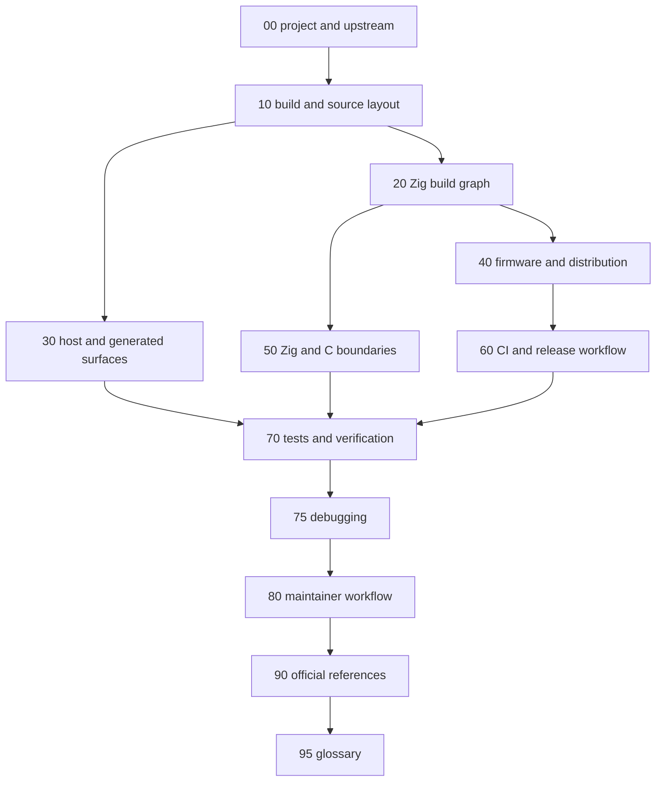

# z47 Development Docs

This directory is the maintained z47 developer-doc surface for the checked-in
Zig-first port workspace.

These pages are code-facing maintainer docs, not end-user usage docs.

Audit basis: 2026-07-30, upstream pin `4697e526a`, Zig `0.16.0` stable. Update
these stamps in [00-project-and-upstream.md](00-project-and-upstream.md) whenever
the pin or toolchain advances.

## Port Status In One Paragraph

The calculator core is fully ported to Zig. The product builds (the GTK host
simulator and the DMCP/DMCP5 firmware) contain zero first-party calculator C:
`report-c-dependency-status.py` reports 0 active product-build first-party C
files. The upstream C tree (`src/`, `dep/`) is retained only as verification
reference -- the shared testSuite and per-owner parity oracles that prove the Zig
behaves byte-for-byte like upstream. Retained third-party C is explicit and
unchanged: the vendored `dep/decNumberICU` is compiled by Zig, and the build
links GTK 3, GMP, FreeType 2, optional PulseAudio (host) and the SwissMicros
DMCP/DMCP5 SDKs (firmware). Ongoing work is idiomatic-Zig refinement and periodic
upstream resync, not further core porting.

These pages document tracked, maintained repo surfaces only. They do not define
ignored local worktrees, ignored build outputs, or other ignored paths.

## Maintainer Doc Flow

## Read In Order

- [00-project-and-upstream.md](00-project-and-upstream.md): what z47 is, what the
  imported upstream C47 tree is, what the repo owns, and where the port boundary
  now sits (core fully in Zig; C retained for parity)
- [10-build-and-source-layout.md](10-build-and-source-layout.md): canonical build
  entrypoints, ownership layout, checked-in pins, outputs, and local maintainer
  flow
- [20-zig-build-graph.md](20-zig-build-graph.md): how `build.zig` routes work into
  the host, firmware, distribution, generator, and verification domains
- [30-host-and-generated-surfaces.md](30-host-and-generated-surfaces.md): host
  simulator, generated artifacts, docs build, and retained host dependency
  contracts
- [40-firmware-and-distribution.md](40-firmware-and-distribution.md): DMCP and
  DMCP5 firmware targets, package variants, and host-package rules
- [50-zig-c-boundaries-and-rewrite-policy.md](50-zig-c-boundaries-and-rewrite-policy.md):
  the seam-and-core architecture, retained C surfaces, approved boundaries, and
  the rules for adding a new Zig or C seam
- [60-ci-and-release-workflow.md](60-ci-and-release-workflow.md): GitHub Actions
  lane split, governance guards, artifacts, and local reproduction map
- [70-tests-and-verification.md](70-tests-and-verification.md): the one-command
  local gate, focused rerun lanes, parity oracles, and generated-artifact checks
- [75-debugging.md](75-debugging.md): what each detector can and cannot see, the
  C-vs-Zig differential procedure, and the false-pass catalogue
- [80-maintainer-workflow.md](80-maintainer-workflow.md): how to keep the doc set
  and root entrypoints aligned with the live repo, plus the upstream resync flow
- [90-official-references.md](90-official-references.md): canonical upstream, Zig,
  dependency, and workflow references, plus the companion upstream-behaviour doc
  set
- [95-glossary.md](95-glossary.md): the two tiers of vocabulary -- the
  calculator's terms, which upstream owns, and the terms this port invented

## By Task

- build break, missing target, wrong output path, or stale build note:
  [10-build-and-source-layout.md](10-build-and-source-layout.md) and
  [20-zig-build-graph.md](20-zig-build-graph.md)
- host simulator, generated-artifact, or docs-build change:
  [30-host-and-generated-surfaces.md](30-host-and-generated-surfaces.md) and
  [70-tests-and-verification.md](70-tests-and-verification.md)
- firmware, DMCP package, or distribution change:
  [40-firmware-and-distribution.md](40-firmware-and-distribution.md),
  [60-ci-and-release-workflow.md](60-ci-and-release-workflow.md), and
  [70-tests-and-verification.md](70-tests-and-verification.md)
- Zig/C boundary, `@cImport`, direct `extern`, or generated-seam change:
  [50-zig-c-boundaries-and-rewrite-policy.md](50-zig-c-boundaries-and-rewrite-policy.md)
  and [70-tests-and-verification.md](70-tests-and-verification.md)
- upstream resync (pin advance):
  [80-maintainer-workflow.md](80-maintainer-workflow.md) and the committed
  `.github/project/upstream-resync-runbook.md`
- CI lane, governance guard, package artifact, or release-proof change:
  [60-ci-and-release-workflow.md](60-ci-and-release-workflow.md) and
  [70-tests-and-verification.md](70-tests-and-verification.md)
- maintainer-doc update workflow or page-routing change:
  [80-maintainer-workflow.md](80-maintainer-workflow.md)
- a green lane and a wrong answer, or a divergence with no crash:
  [75-debugging.md](75-debugging.md)
- memory safety: what is defended, what proves it, and what is still open --
  the posture and rules in
  [50-zig-c-boundaries-and-rewrite-policy.md](50-zig-c-boundaries-and-rewrite-policy.md),
  what each detector can and cannot see in
  [75-debugging.md](75-debugging.md), and the external basis in
  [90-official-references.md](90-official-references.md)
- one target red and every other target green, or a stray write on a lane you
  cannot run locally: [75-debugging.md](75-debugging.md)
- a term in any of these pages you do not recognise:
  [95-glossary.md](95-glossary.md)

## Build Entry Points

Maintainer entrypoints (see [10](10-build-and-source-layout.md) and
[20](20-zig-build-graph.md) for the full graph):

- `zig build` or `zig build sim`: canonical host build entrypoint
- `zig build both`: build both host simulators (C47 and R47)
- `zig build test`: canonical grouped host regression lane (the shared upstream
  testSuite plus the Zig-owned suites; 12721 cases at the current pin -- the run
  prints the total)
- `zig build test:unit`: native Zig unit tests with no C oracle
- `zig build generated`: refresh all tracked generated host artifacts
- `zig build constants`, `zig build catalogs`, `zig build fonts`,
  `zig build testPgms`: individual generator lanes
- `zig build docs`: canonical docs build for `docs/code`
- `zig build dmcp` or `zig build dmcp5`: canonical firmware entrypoints
- `zig build dist_linux`, `zig build dist_macos`, or `zig build dist_windows`:
  host-package entrypoints on the matching host OS

Verification entrypoints:

- `bash .github/project/run-local-gate.sh`: one command that reproduces the full
  Linux CI verdict before pushing (governance guards + the host-parity
  build/test/oracle battery + the tracked-generated-artifact diff)
- the per-owner parity oracles (`zig build <owner>_parity`) prove each Zig owner
  matches its retained upstream C; see
  [70-tests-and-verification.md](70-tests-and-verification.md)

## Repo-Owned Automation Layout

- `build.zig` is the small repo-root router for options and top-level steps.
- `build/` owns the host, firmware, distribution, generator, and test-domain
  build registration plus the Zig host and firmware HAL replacements.
- `src/` owns the ported calculator core (the Zig owners).
- `.github/` owns CI workflows, pins, governance guards, and packaging helpers.
- `docs/` owns the maintained developer-doc set for the live repo.

If a change affects both the maintained doc set and one of the tracked build or
workflow contracts, update the affected docs and tracked source files in one
pass.
