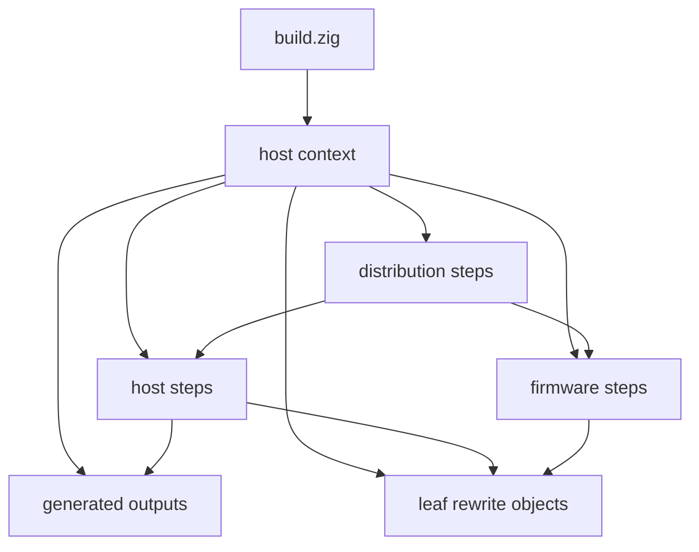

# Zig Build Graph

This page explains how the repo-root `build.zig` routes work into the host,
firmware, distribution, generator, and rewrite domains.

Read [10-build-and-source-layout.md](10-build-and-source-layout.md) first.
This page assumes the entrypoints, pins, and output paths are already clear.

## Router Contract

The repo-root `../build.zig` is intentionally small.

Its current responsibilities are:

1. parse the project-specific options
2. create the shared host context through `zig_build/host.zig`
3. register host steps
4. register firmware steps
5. register distribution steps

The root router does not own most domain-specific source lists, platform glue,
or packaging logic.

## Domain Split

| Surface | Current role |
| --- | --- |
| `../build.zig` | option parsing, root orchestration, and domain wiring |
| `../zig_build/common.zig` | shared helpers, C flag tables, and build utilities |
| `../zig_build/host.zig` | stable facade for host context creation and host step registration |
| `../zig_build/host/context.zig` | host context creation, source resolution, and generated-output setup |
| `../zig_build/host/generated.zig` | version-header and generator output integration |
| `../zig_build/host/builders.zig` | simulator and host test executable builders |
| `../zig_build/host/steps.zig` | public host steps plus docs and clean |
| `../zig_build/host/platform.zig` | GTK, FreeType, Windows pkg-config, and system path glue |
| `../zig_build/firmware.zig` | firmware orchestration, retained SDK integration, CRC helper, and cross-GMP bootstrap |
| `../zig_build/dist.zig` | host and firmware distribution step registration |
| `../zig_build/zig_dist.py` | Python packaging helper used by the Zig distribution steps |
| `../zig_build/tools/` | Zig-owned deterministic generator entrypoints |
| `../zig_build/leaf/` | current parity-gated manual Zig rewrite slice |

## Build Graph Shape

## Public Step Inventory

The live build graph currently exposes these step groups.

### Host simulators and tests

- `sim`
- `all`
- `simr47`
- `both`
- `both_asan`
- `logical_shortint_parity`
- `test`
- `test_asan`
- `repeattest`

### Generated artifacts and docs

- `fonts`
- `constants`
- `catalogs`
- `testpgms`
- `testPgms`
- `generated`
- `docs`
- `clean`

### Firmware

- `dmcp`
- `dmcpr47`
- `dmcp5`
- `dmcp5r47`
- `dmcp_pkg1`
- `dmcp_pkg2`
- `dmcp_pkg3`
- `dmcp_pkgs_all`

### Distribution

- `dist`
- `dist_windows`
- `dist_macos`
- `dist_linux`
- `dist_dmcp`
- `dist_dmcpr47`
- `dist_dmcp5`
- `dist_dmcp5r47`
- `dist_dmcp_pkg1`
- `dist_dmcp_pkg2`
- `dist_dmcp_pkg3`
- `dist_dmcp_pkgs_all`
- `dist_dmcp_pkgs_1_2`
- `dist_dmcp_pkgs_small`
- `distS`

## Project-Specific Options

The live project-specific options reported by `zig build --help` are:

- `-Doptimize=<Debug|ReleaseSafe|ReleaseFast|ReleaseSmall>`
- `-Dci-commit-tag=<string>`
- `-Draspberry=<bool>`
- `-Ddecnumber-fastmul=<bool>`
- `-Ddmcp-package=<int>`

`dmcp` and `dmcpr47` use `-Ddmcp-package` with a default value of `4`.
Dedicated fixed-package steps exist for package variants `1`, `2`, and `3`.

## Generated Output Wiring

The host context wires deterministic generator outputs back into tracked files.
The public update steps are implemented in `../zig_build/host/steps.zig` and
copy generated output back to source-controlled locations through
`addUpdateSourceFiles()`.

That contract keeps the tracked generated calculator sources and generated test
program data under explicit Zig build ownership instead of ad hoc scripts.

## Version And Packaging Metadata

The distribution domain resolves the package version from the explicit
`-Dci-commit-tag` option when present. Otherwise it falls back to
`git describe --match=NeVeRmAtCh --always --abbrev=8 --dirty=-mod`.

That fallback is a z47 packaging convenience. It does not replace the separate
checked-in upstream pin under `../.github/project/upstream-pin.env`.

## Change Rules

- Keep `../build.zig` as a thin router.
- Add or rename public steps in one place, then update `../ZIG-README.md`,
  `zig_docs/`, and any affected workflow or packaging code in the same change.
- Keep new platform-specific behavior centralized in `../zig_build/host/` or
  `../zig_build/firmware.zig`, not scattered through the tree.
- Do not move imported upstream compatibility helpers such as `../tag2ver.py`
  just to make the Zig layout look cleaner. The imported legacy build graph
  still references them.