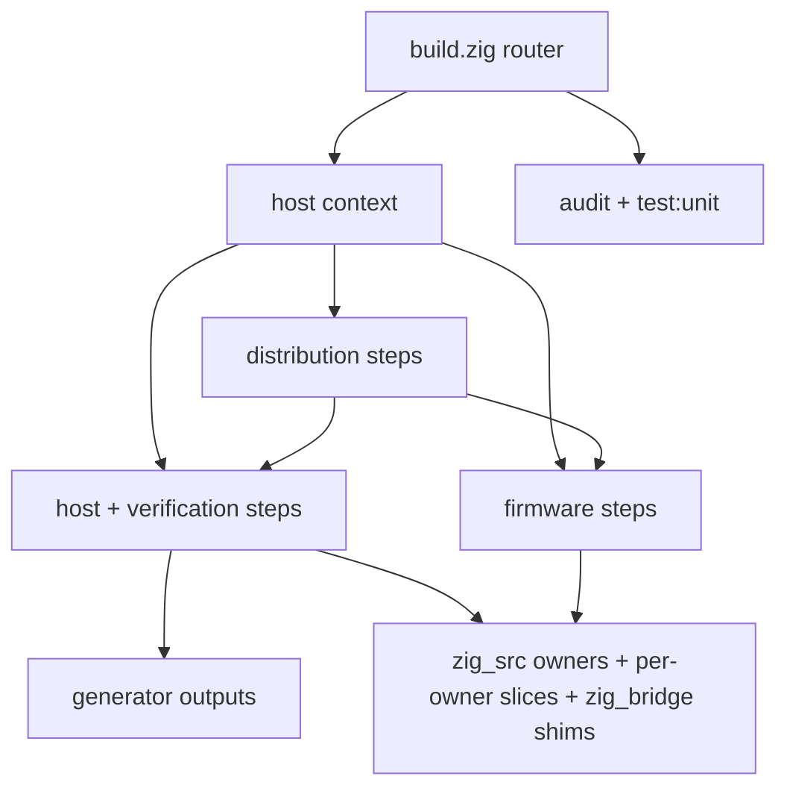

# Zig Build Graph

This page explains how the repo-root `build.zig` routes work into five build
domains: host, firmware, distribution, generators, and tests/verification. It is
the architecture view of `zig_build/` -- the structure of the domains and how
top-level steps map onto them.

Read [10-build-and-source-layout.md](10-build-and-source-layout.md) first. This
page assumes the entrypoints, pins, and output paths are already clear. For the
flat list of maintainer entrypoints, see page 10 and the live
`zig build --help`; this page does not repeat that list.

Audit basis: 2026-07-10, upstream pin `0caee2adc`, Zig `0.16.0` stable.

## Router Contract

The repo-root `../build.zig` is intentionally small. It parses options and wires
the domains together; it does not own domain source lists, platform glue, or
packaging logic.

Its current top-level responsibilities, in order, are:

1. register the C-dependency audit steps (`check-c-deps*`)
2. register the native Zig unit-test step (`test:unit`)
3. parse the project-specific options
4. create the shared host context through `zig_build/host.zig`
   (`prepareContext`)
5. register host steps (`host.zig` -> `host/steps.zig`)
6. register firmware steps (`firmware.zig`)
7. register distribution steps (`dist.zig`)

The `check-c-deps*` and `test:unit` steps are self-contained and are registered
directly in `../build.zig`; every other public step is registered inside its
domain module.

## Domain Split

`zig_build/` is organized into the five domains this page describes, plus the
Zig HAL replacements that stand in for upstream C and the per-owner
build-registration slices shared by the host and firmware domains.

| Surface | Domain / role |
| --- | --- |
| `../build.zig` | option parsing, root orchestration, `check-c-deps*` and `test:unit` |
| `../zig_build/common.zig` | shared helpers, C flag tables, upstream-path resolution |
| `../zig_build/host.zig` | stable facade for host context creation and host step registration |
| `../zig_build/host/context.zig` | host context creation, source resolution, generated-output setup |
| `../zig_build/host/generated.zig` | version-header and generator output integration |
| `../zig_build/host/builders.zig` | simulator and host test/parity executable builders |
| `../zig_build/host/steps.zig` | public host, generator, docs, clean, and verification steps |
| `../zig_build/host/platform.zig` | GTK, FreeType, Windows pkg-config, and system path glue |
| `../zig_build/host/gtk_*.zig` | Zig GTK 3 host layer that replaces the upstream `src/c47-gtk` C |
| `../zig_build/firmware.zig` | firmware orchestration, SDK integration, CRC helper, cross-GMP bootstrap |
| `../zig_build/firmware_*_runtime.zig` | Zig DMCP/DMCP5 HAL (audio, file I/O, print IR) that replaces the upstream firmware C |
| `../zig_build/dist.zig` | host and firmware distribution step registration |
| `../zig_build/zig_dist.py` | Python packaging helper used by the Zig distribution steps |
| `../zig_build/tools/` | Zig-owned deterministic generator entrypoints (constants, catalogs, testPgms, fonts, reserved-register lookup) plus `translate_c` seam headers |
| `../zig_build/tests/` | parity oracles, fake runtimes, harnesses, and `testsuite_hal.zig` (the Zig testSuite HAL that replaces `src/testSuite/hal/*.c`) |
| `../zig_build/{constants,shortint,state,mathematics,frontier,solver,ui}/` | per-owner build registration that wires the `zig_src/` owners into both the host and firmware builds |
| `../zig_src/` | the ported calculator core (the live Zig owners) |
| `../zig_bridge/` | near-retired legacy header shims paired with a few owners |

The Zig HAL replacements (`host/gtk_*.zig`, `firmware_*_runtime.zig`,
`tests/testsuite_hal.zig`) are compiled and linked in place of the corresponding
upstream C. The retained third-party C -- vendored `dep/decNumberICU` compiled by
Zig, plus external GTK 3, GMP, FreeType 2, optional PulseAudio (host), and the
SwissMicros DMCP/DMCP5 SDKs (firmware) -- is still linked by these domains; see
[00-project-and-upstream.md](00-project-and-upstream.md) and
[50-zig-c-boundaries-and-rewrite-policy.md](50-zig-c-boundaries-and-rewrite-policy.md).

## Build Graph Shape

```mermaid
flowchart TD
  A[build.zig router]
  B[host context]
  C[host + verification steps]
  D[firmware steps]
  E[distribution steps]
  F[generator outputs]
  G[zig_src owners + per-owner slices + zig_bridge shims]
  H[audit + test:unit]

  A --> H
  A --> B
  B --> C
  B --> D
  B --> E
  C --> F
  C --> G
  D --> G
  E --> C
  E --> D
```

## Top-Level Steps By Domain

The public steps group onto the domains as follows. See page 10 for the flat
entrypoint list and `zig build --help` for the authoritative set.

| Domain | Registered in | Step groups |
| --- | --- | --- |
| Host simulators | `host/steps.zig` | `sim`/`all`, `simr47`, `both`, `both_asan`, `simulator_smoke` |
| Generators | `host/steps.zig` (driving `tools/`) | `fonts`, `constants`, `catalogs`, `testpgms`/`testPgms`, `generated` |
| Docs and cleanup | `host/steps.zig` | `docs`, `clean` |
| Tests and verification | `host/steps.zig` (driving `tests/`) and `build.zig` | grouped host lanes `test`, `test_asan`, `repeattest`; native `test:unit`; the `pgm_load_fuzz` malformed-input load lane; C-dependency audits `check-c-deps*`; the per-owner `*_parity` suites, `*_oracle` helpers, and focused regression/harness lanes |
| Firmware | `firmware.zig` | `dmcp`, `dmcpr47`, `dmcp5`, `dmcp5r47`, the fixed-package `dmcp_pkg1`/`2`/`3`, and `dmcp_pkgs_all` |
| Distribution | `dist.zig` | host `dist_linux`/`dist_macos`/`dist_windows`, firmware `dist_dmcp*`, the `dist_dmcp_pkgs_*` bundles, and the aggregate `dist`/`distS` |

The firmware step names (including the per-package variants) come from config
structs inside `firmware.zig`, not from literal `b.step(...)` calls, so a plain
grep for step strings misses them.

## Project-Specific Options

The live project-specific options reported by `zig build --help` are:

- `-Doptimize=<Debug|ReleaseSafe|ReleaseFast|ReleaseSmall>`
- `-Dci-commit-tag=<string>`
- `-Draspberry=<bool>` (default `false`)
- `-Ddecnumber-fastmul=<bool>` (default `true`)
- `-Ddmcp-package=<int>` (default `4`)

`dmcp` and `dmcpr47` use `-Ddmcp-package` with a default value of `4`. Dedicated
fixed-package steps exist for package variants `1`, `2`, and `3`.

## Generated Output Wiring

The host context wires deterministic generator outputs back into tracked files.
The public update steps are implemented in `../zig_build/host/steps.zig` and copy
generator output back to source-controlled locations through
`addUpdateSourceFiles()`.

That contract keeps the tracked generated calculator sources and generated
test-program data under explicit Zig build ownership instead of ad hoc scripts.

## Version And Packaging Metadata

The distribution domain resolves the package version from the explicit
`-Dci-commit-tag` option when present. Otherwise it falls back to
`git describe --match=NeVeRmAtCh --always --abbrev=8 --dirty=-mod`.

That fallback is a z47 packaging convenience. It does not replace the separate
checked-in upstream pin under `../.github/project/upstream-pin.env`.

## Change Rules

- Keep `../build.zig` as a thin router. Push domain-specific logic down into the
  matching `zig_build/` domain module.
- Add or rename public steps in one place, then update `../README.md`, the
  page 10 entrypoint list, `zig_docs/`, and any affected workflow or packaging
  code in the same change.
- Keep new platform-specific behavior centralized in `../zig_build/host/` or
  `../zig_build/firmware.zig`, not scattered through the tree.
- Add new parity oracles, fake runtimes, or harnesses under
  `../zig_build/tests/` and register their steps in `../zig_build/host/steps.zig`.
- Do not move imported upstream compatibility helpers such as `../upstream/tag2ver.py`
  just to make the Zig layout look cleaner. The imported legacy build graph still
  references them.
