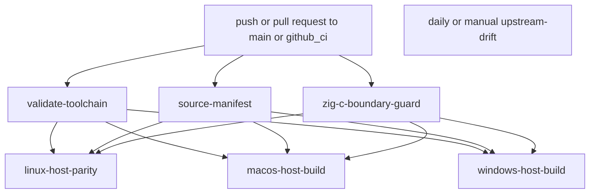

# CI And Release Workflow

This page explains the GitHub Actions lane split for z47, what each workflow
verifies, which artifacts it publishes, and how to reproduce the same checks
locally.

Read [10-build-and-source-layout.md](10-build-and-source-layout.md) first.
This page assumes the build entrypoints and output paths are already clear.

## CI At A Glance

Current tracked workflows:

| Workflow file | Trigger | Purpose |
| --- | --- | --- |
| `../.github/workflows/upstream-oracle.yml` | pushes and pull requests targeting `main` or `github_ci`, plus manual dispatch | main host, docs, firmware, package, and boundary validation surface |
| `../.github/workflows/upstream-drift.yml` | daily schedule at `0 5 * * *`, plus manual dispatch | report whether the pinned upstream commit still matches upstream HEAD |

## Workflow Graph

## Shared CI Inputs

The workflow keeps its shared checked-in control data in these files:

- `../.github/zig-toolchain.env`
- `../.github/project/upstream-pin.env`
- `../.github/project/zig-c-boundaries.txt`
- `../docs/code/requirements.txt`

The host platform jobs also resolve the current upstream HEAD of the xlsxio
helper repository and use that SHA in their cache keys.

## Job Graph

### `validate-toolchain`

Purpose:

- load the checked-in Zig pin
- verify the pinned version and Linux SHA-256 against
  `https://ziglang.org/download/index.json`
- install the pinned Zig version and verify `zig version`

### `source-manifest`

Purpose:

- verify that the checked-out repo still descends from the pinned upstream
  commit
- upload a source manifest artifact for the imported root tree

Current source-manifest note:

- the artifact intentionally excludes `build.zig` and `.github/**` so the
  z47-owned control plane does not masquerade as imported upstream content

### `zig-c-boundary-guard`

Purpose:

- run `bash .github/project/check-zig-c-boundaries.sh`
- fail early if checked-in Zig boundary usage drifts from the approved allowlist

### `linux-host-parity`

Purpose:

- build and test the host simulator surface on Linux
- run `logical_shortint_parity`, `both`, `testPgms`, `test`, `generated`,
  `both_asan`, `test_asan`, `docs`, firmware targets, and Linux distribution
  packaging
- run a Linux simulator smoke launch from the packaged archive
- refresh and diff tracked generated artifacts
- upload the Linux package artifact and a second artifact containing the golden
  generated files plus their hashes

### `macos-host-build`

Purpose:

- build and test the host simulator surface on macOS
- run `logical_shortint_parity`, `both`, `test`, and `generated`
- run a macOS simulator smoke launch from the built simulator artifact
- stage and upload a macOS package artifact

Current platform detail:

- the job only installs missing Homebrew formulae so repeated runs stay
  idempotent and warning-light

### `windows-host-build`

Purpose:

- build and test the host simulator surface on Windows under MSYS2 UCRT64
- run `logical_shortint_parity`, `both`, `test`, and `generated`
- run a direct simulator smoke launch
- build a relocatable Windows package with GTK runtime assets, launcher files,
  runtime caches, and notice metadata
- inspect packaged imports and run a relocated launcher smoke test before
  artifact upload

## Artifacts And Release Proof

Current artifact classes include:

- source-manifest artifact from `source-manifest`
- Linux generated-artifact proof from `linux-host-parity`
- packaged simulator artifacts named `z47-linux-<upstream_short>`,
  `z47-macos-<upstream_short>`, and `z47-windows-<upstream_short>`
- the `upstream-drift` report artifact from the scheduled drift workflow

Linux packaging also stages explicit build metadata, source provenance, and
runtime notice inventory. Windows packaging additionally records staged GTK
runtime directories, runtime tools, launcher files, and DLL notice inventory.

## Local Reproduction Map

Use the smallest local lane that matches the workflow slice you changed.

| Workflow slice | Smallest local reproduction |
| --- | --- |
| toolchain pin | `zig version` plus a read of `../.github/zig-toolchain.env` |
| source manifest or upstream pin | `git merge-base --is-ancestor <pinned-upstream> HEAD` |
| Zig or C boundary guard | `bash .github/project/check-zig-c-boundaries.sh` |
| Linux host parity | `zig build logical_shortint_parity && zig build both && zig build test && zig build generated` |
| Linux docs | `zig build docs` |
| Linux firmware | `zig build dmcp && zig build dmcpr47 && zig build dmcp5 && zig build dmcp5r47` |
| host package | run the matching `dist_<host>` target on the matching host OS |

## Upstream Drift Workflow

`../.github/workflows/upstream-drift.yml` runs daily and on manual dispatch.

Current behavior:

- query the current upstream HEAD from the pinned repository URL
- compare it with the checked-in `UPSTREAM_COMMIT`
- write an artifact that records whether upstream moved or the query failed

This workflow is reporting-only. It does not auto-update the pin.

## CI Change Rules

- Keep the lane split explicit. Do not hide docs, firmware, package, and
  boundary validation behind one generic step.
- Keep the shared pins in the checked-in files listed above.
- Keep logs and artifacts uploadable even when a later verification step fails.
- Update this page when job names, artifact names, trigger branches, or local
  reproduction commands change.