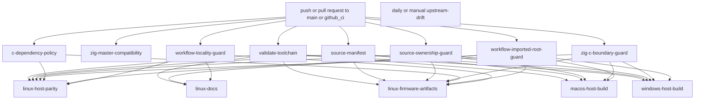

# CI And Release Workflow

This page explains the GitHub Actions lane split for z47, what each workflow
verifies, which artifacts it publishes, and how to reproduce the same checks
locally.

Read [10-build-and-source-layout.md](10-build-and-source-layout.md) first.
This page assumes the build entrypoints and output paths are already clear.

## CI At A Glance

Current tracked workflows:

| Workflow file | Trigger | Purpose |
| --- | --- | --- |
| `../.github/workflows/upstream-oracle.yml` | pushes and pull requests targeting `main` or `github_ci`, plus manual dispatch | main host, docs, firmware publication, package, boundary, and monitored Zig master compatibility surfaces |
| `../.github/workflows/upstream-drift.yml` | daily schedule at `0 5 * * *`, plus manual dispatch | report whether the pinned upstream commit still matches upstream HEAD |

## Workflow Graph

```mermaid
flowchart TD
  A[push or pull request to main or github_ci]
  B[validate-toolchain]
  C[zig-master-compatibility]
  D[source-manifest]
  E[source-ownership-guard]
  F[zig-c-boundary-guard]
  G[c-dependency-policy]
  H[workflow-imported-root-guard]
  I[workflow-locality-guard]
  J[linux-host-parity]
  K[linux-docs]
  L[linux-firmware-artifacts]
  M[macos-host-build]
  N[windows-host-build]
  O[daily or manual upstream-drift]

  A --> B
  A --> C
  A --> D
  A --> E
  A --> F
  A --> G
  A --> H
  A --> I
  B --> J
  D --> J
  E --> J
  F --> J
  G --> J
  H --> J
  I --> J
  B --> K
  H --> K
  I --> K
  B --> L
  D --> L
  E --> L
  F --> L
  G --> L
  H --> L
  I --> L
  B --> M
  D --> M
  E --> M
  F --> M
  H --> M
  B --> N
  D --> N
  E --> N
  F --> N
  H --> N
```

## Shared CI Inputs

The workflow keeps its shared checked-in control data in these files:

- `../.github/zig-toolchain.env`
- `../.github/project/upstream-pin.env`
- `../.github/project/source-ownership.txt`
- `../.github/project/workflow-imported-root-paths.sh`
- `../.github/project/zig-c-boundaries.txt`
- `../docs/code/requirements.txt`

The Linux docs lane caches the Python package download directory keyed by the
helper-resolved docs requirements file. The host platform jobs and the Linux
firmware lane also resolve the current upstream HEAD of the xlsxio helper
repository and use that SHA in their cache keys.

The workflow imported-root guard uses
`../.github/project/workflow-imported-root-paths.sh` as the shared path
vocabulary for docs install, generated-artifact proof, and host package
staging. That keeps the workflow text aligned with `UPSTREAM_ROOT` instead of
repeating repo-root imported paths ad hoc.

## Job Graph

### `validate-toolchain`

Purpose:

- load the checked-in Zig pin
- verify the pinned version and Linux SHA-256 against
  `https://ziglang.org/download/index.json`
- install the pinned Zig version and verify `zig version`

### `zig-master-compatibility`

Purpose:

- load the checked-in monitored Zig master snapshot from
  `../.github/zig-toolchain.env`
- install that monitored snapshot through the same setup action used for the
  stable lane
- install the Linux xlsxio helper plus the host generator prerequisites needed
  by generator-backed host builds
- run `zig build --help --summary none` and
  `zig build logical_shortint_parity --summary none` plus
  `zig build rotate_bits_parity --summary none` plus
  `zig build logical_boolean_ops_suite --summary none` as narrow
  forward-compatibility probes for the generator-backed host lane

Current monitoring rule:

- this job is `continue-on-error: true`, so it reports compatibility drift
  without becoming the required merge gate

### `source-manifest`

Purpose:

- verify that the pinned upstream commit is still reachable from the current
  `upstream/master` tip
- upload a source manifest artifact for the imported root tree

Current source-manifest note:

- the artifact now takes its imported-root path list from
  `../.github/project/source-ownership.txt`, so the published source manifest
  and the ownership guard use the same tracked vocabulary

### `source-ownership-guard`

Purpose:

- run `bash .github/project/check-source-ownership.sh`
- verify that the tracked ownership manifest still covers the top-level tracked
  tree
- reject unapproved added files under imported upstream-shaped roots

Current ownership-guard note:

- the job fetches the configured upstream branch first so the guard can diff
  branch-added imported-root files from the merge base between `HEAD` and the
  pinned upstream commit even when the pin is ahead of the current branch tip

### `zig-c-boundary-guard`

Purpose:

- run `bash .github/project/check-zig-c-boundaries.sh`
- fail early if checked-in Zig boundary usage drifts from the approved allowlist

### `workflow-imported-root-guard`

Purpose:

- run `bash .github/project/workflow-imported-root-paths.sh check-workflow`
- fail early if workflow files reintroduce direct repo-root imported-path
  literals for docs inputs, generated-artifact proof, or host package staging

Current imported-root-guard note:

- the helper resolves the workflow-owned imported inputs through the same
  `UPSTREAM_ROOT` vocabulary used by the Zig build graph and the M13 pilot
  tooling, and the guard keeps the remaining direct workflow references at zero

### `workflow-locality-guard`

Purpose:

- run `bash .github/project/check-ci-no-local-dev-scripts.sh`
- fail early if workflow steps reintroduce `__DEV/` script dependencies

### `linux-host-parity`

Purpose:

- build and test the host simulator surface on Linux
- run `logical_shortint_parity`, `rotate_bits_parity`,
  `logical_boolean_ops_suite`, `stack_state_parity`, `register_metadata_parity`,
  `flags_parity`, `memory_parity`, `program_serialization_parity`,
  `calc_state_parity`, `math_command_wrappers_parity`,
  `math_random_parity`,
  `keyboard_state_parity`, `both`, `simulator_smoke`, `testPgms`, `test`,
  `generated`, `both_asan`, `test_asan`, and Linux host distribution packaging
- build the published Linux host archive with
  `zig build -Doptimize=ReleaseFast dist_linux` so the uploaded package matches
  the desktop release-size contract
- run the checked-in Xvfb-backed simulator smoke lane for both host
  simulators before the broader grouped host test lane
- run a Linux simulator smoke launch from the packaged archive
- diff and hash tracked generated artifacts
- upload the Linux package artifact and a second artifact containing the golden
  generated files plus their hashes

Current Linux host-lane detail:

- docs and firmware publication now live in separate Linux jobs, so this lane
  no longer installs Doxygen, Python docs packages, or Arm GCC
- moving the docs build out also removed the extra `generated` rerun that used
  to compensate for the docs lane calling `zig build clean`
- the lane now restores Linux-local Zig build caches across workflow runs, so
  repeat runs spend less time recompiling unchanged build graph slices

### `linux-docs`

Purpose:

- install Doxygen plus the Python docs packages from
  `../docs/code/requirements.txt`
- cache the Python package download directory through `actions/cache`
- run `zig build docs`
- keep docs-only dependencies out of the Linux host and firmware lanes

### `linux-firmware-artifacts`

Purpose:

- run the Linux firmware validation surface through `zig build dmcp`,
  `zig build dmcpr47`, `zig build dmcp5`, and `zig build dmcp5r47`
- run the Linux firmware publication surface through `dist_dmcp`,
  `dist_dmcp_pkg1`, `dist_dmcp_pkg2`, `dist_dmcp_pkg3`, `dist_dmcpr47`,
  `dist_dmcp5`, and `dist_dmcp5r47`
- stage and upload the published Linux firmware artifact without changing its
  artifact name or published C47 firmware zip set

Current Linux firmware-lane detail:

- this lane keeps the Arm GCC dependency out of `linux-host-parity` while still
  reusing the shared xlsxio helper cache shape
- the lane now restores its own Linux Zig build caches on repeat runs

Current shared helper-cache detail:

- xlsxio helper caches now key on upstream xlsxio HEAD plus the manual
  `XLSXIO_HELPER_CACHE_VERSION` schema instead of the whole workflow file, so
  unrelated CI YAML edits no longer force helper rebuilds across Linux, macOS,
  and Windows lanes

Current shared Zig build-cache and optimize detail:

- Linux host, Linux docs, Linux firmware, and macOS host lanes now restore
  lane-scoped Zig local/global build caches through `actions/cache`, which is
  the repeat-run analogue of the `ccache` pattern used by the example
  `r47zen` workflows
- `zig build` is still left to its default parallelism because `zig build
  --help` reports `-j` already defaults to all CPU cores
- published desktop host artifacts were already at the fastest safe setting:
  `ReleaseFast` for the staged binaries, while `zig_build/common.zig` still
  resolves x86/x86_64 host-package targets to a baseline CPU model instead of
  runner-native features

### `macos-host-build`

Purpose:

- build and test the host simulator surface on macOS
- run `logical_shortint_parity`, `rotate_bits_parity`,
  `logical_boolean_ops_suite`, `stack_state_parity`, `register_metadata_parity`,
  `flags_parity`, `memory_parity`, `program_serialization_parity`,
  `calc_state_parity`, `math_command_wrappers_parity`,
  `math_random_parity`,
  `keyboard_state_parity`, `both`, `test`, and `generated`
- rebuild `both` in `ReleaseFast` before the smoke and staging steps so the
  uploaded macOS archive uses release host binaries
- run a macOS simulator smoke launch from the built simulator artifact
- stage and upload a macOS package artifact

Current platform detail:

- the job only installs missing Homebrew formulae so repeated runs stay
  idempotent and warning-light
- the lane now restores the macOS Zig local/global caches on repeat runs

### `windows-host-build`

Purpose:

- build and test the host simulator surface on Windows under MSYS2 UCRT64
- run `logical_shortint_parity`, `rotate_bits_parity`,
  `logical_boolean_ops_suite`, `stack_state_parity`, `register_metadata_parity`,
  `flags_parity`, `memory_parity`, `program_serialization_parity`,
  `calc_state_parity`, `math_command_wrappers_parity`,
  `math_random_parity`,
  `keyboard_state_parity`, `both`, `test`, and `generated`
- rebuild `both` in `ReleaseFast` before the direct smoke and staging lanes
- run a direct simulator smoke launch
- build a relocatable Windows package with GTK runtime assets, launcher files,
  runtime caches, and notice metadata
- inspect packaged imports and run a relocated launcher smoke test before
  artifact upload

Current Windows host-lane detail:

- the lane now reuses the runner-image MSYS2 installation through
  `release: false` while keeping `update: true`, which cuts cold-start setup
  without changing the full package-refresh policy
- all Windows UCRT64 packages now install in the cached `setup-msys2` step, so
  the separate follow-on `pacman -S` step is gone and the unused `make`
  package no longer bloats the lane
- after comparing the lane with `r47zen/.github/workflows/windows-ci.yml`, the
  staged GTK runtime directory and tool set stays unchanged because the peer
  workflow publishes the same core GTK payload; the speed work instead targets
  setup reuse, helper-cache churn, and artifact upload
- the Windows notice generator now batches `pacman -Qqo` ownership lookups over
  resolved staged runtime paths, which removes the previous one-process-per-file
  regression across large GTK icon, theme, and MIME trees during artifact
  staging

## Artifacts And Release Proof

Current artifact classes include:

- source-manifest artifact from `source-manifest`
- source-ownership guard result from `source-ownership-guard`
- Linux generated-artifact proof from `linux-host-parity`
- packaged simulator artifacts named `z47-linux-<upstream_short>`,
  `z47-macos-<upstream_short>`, and `z47-windows-<upstream_short>`
- Linux SwissMicros firmware artifact from `linux-firmware-artifacts` named
  `z47-firmware-<upstream_short>` containing `c47-dmcp.zip`,
  `c47-dmcp-pkg1.zip`, `c47-dmcp-pkg2.zip`, `c47-dmcp-pkg3.zip`, and
  `c47-dmcp5.zip`
- the `upstream-drift` report artifact from the scheduled drift workflow

Linux packaging also stages explicit build metadata, source provenance, and
runtime notice inventory. Windows packaging additionally records staged GTK
runtime directories, runtime tools, launcher files, and DLL notice inventory.
The published desktop host artifacts now stage `ReleaseFast` simulator
binaries, and the Unix package helper strips the staged simulator copies before
archiving them.

## Local Reproduction Map

Use the smallest local lane that matches the workflow slice you changed.

| Workflow slice | Smallest local reproduction |
| --- | --- |
| toolchain pin | `zig version` plus a read of `../.github/zig-toolchain.env` |
| monitored Zig master compatibility | install the monitored `ZIG_MASTER_VERSION`, ensure `xlsxio_xlsx2csv` plus the Linux GTK, FreeType, and GMP generator prerequisites are available, then run `zig build --help --summary none && zig build logical_shortint_parity --summary none && zig build rotate_bits_parity --summary none && zig build logical_boolean_ops_suite --summary none` |
| source manifest or upstream pin | `. ./.github/project/upstream-pin.env && git fetch --no-tags "$UPSTREAM_REPOSITORY_URL" "$UPSTREAM_BRANCH" && git merge-base --is-ancestor "$UPSTREAM_COMMIT" FETCH_HEAD && bash .github/project/check-source-ownership.sh` |
| tracked source ownership contract | `. ./.github/project/upstream-pin.env && git fetch --no-tags "$UPSTREAM_REPOSITORY_URL" "$UPSTREAM_BRANCH" && bash .github/project/check-source-ownership.sh` |
| workflow imported-root contract | `bash .github/project/workflow-imported-root-paths.sh check-workflow` |
| Zig or C boundary guard | `bash .github/project/check-zig-c-boundaries.sh` |
| Linux host parity | `bash .github/project/check-zig-c-boundaries.sh && zig build logical_shortint_parity && zig build rotate_bits_parity && zig build logical_boolean_ops_suite && zig build stack_state_parity && zig build register_metadata_parity && zig build flags_parity && zig build memory_parity && zig build program_serialization_parity && zig build calc_state_parity && zig build math_command_wrappers_parity && zig build math_random_parity && zig build keyboard_state_parity && zig build both && zig build simulator_smoke && zig build testPgms && xvfb-run --auto-servernum zig build test && zig build generated && zig build both_asan && xvfb-run --auto-servernum zig build test_asan` |
| Linux docs | `zig build docs` |
| Linux firmware | `zig build dmcp && zig build dmcpr47 && zig build dmcp5 && zig build dmcp5r47` |
| host package | run the matching `dist_<host>` target on the matching host OS; use `-Doptimize=ReleaseFast` when reproducing the published desktop host artifact size contract |
| Linux firmware artifact publication | run `zig build dist_dmcp && zig build dist_dmcp_pkg1 && zig build dist_dmcp_pkg2 && zig build dist_dmcp_pkg3 && zig build dist_dmcpr47 && zig build dist_dmcp5 && zig build dist_dmcp5r47`, then copy the published C47 firmware zips into the firmware artifact staging directory |

## Upstream Drift Workflow

`../.github/workflows/upstream-drift.yml` runs daily and on manual dispatch.

Current behavior:

- query the current upstream HEAD from the pinned repository URL
- compare it with the checked-in `UPSTREAM_COMMIT`
- write an artifact that records whether upstream moved or the query failed

This workflow is reporting-only. It does not auto-update the pin.

## CI Change Rules

- Keep the lane split explicit. Do not hide docs, firmware, package, and
  boundary validation behind one generic step.
- Keep docs-only and Arm-toolchain dependencies out of `linux-host-parity`
  unless that lane consumes them directly again.
- Keep the shared pins in the checked-in files listed above.
- Keep logs and artifacts uploadable even when a later verification step fails.
- Update this page when job names, artifact names, trigger branches, or local
  reproduction commands change.