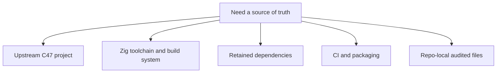

# Official References

This page groups the canonical external and repo-local references that back the
maintainer docs and the checked-in z47 workflow.

Prefer these exact surfaces over broad summaries or secondary writeups.

## Reference Map

## Upstream Project Surfaces

- [C47 GitLab project](https://gitlab.com/rpncalculators/c43): authoritative
  upstream source repository consumed by z47. The path still uses the
  historical `c43` name even though the project identifies itself as C47.
- [README.md](../README.md): imported upstream project overview carried at the
  repo root.
- [BUILD.md](../BUILD.md): imported upstream build-target summary carried at
  the repo root.
- [Makefile](../Makefile): imported upstream human-facing command surface.
- [meson.build](../meson.build): imported upstream root build graph.
- [dep/meson.build](../dep/meson.build): imported upstream dependency build
  wiring.
- [src/c47/meson.build](../src/c47/meson.build): imported upstream main core
  build inputs.
- [src/c47-gtk/meson.build](../src/c47-gtk/meson.build): imported upstream GTK
  simulator build inputs.
- [src/c47-dmcp/meson.build](../src/c47-dmcp/meson.build): imported upstream
  DMCP build inputs.
- [src/c47-dmcp5/meson.build](../src/c47-dmcp5/meson.build): imported upstream
  DMCP5 build inputs.
- [docs/code/meson.build](../docs/code/meson.build): imported upstream code-doc
  build inputs.
- [subprojects/gmp-6.2.1.wrap](../subprojects/gmp-6.2.1.wrap): imported GMP wrap
  reference.

## Zig Toolchain And Build System

- [Zig download page](https://ziglang.org/download/): canonical release entry
  point.
- [Zig download index JSON](https://ziglang.org/download/index.json): canonical
  machine-readable release metadata used by the CI toolchain check.
- [Zig build system docs](https://ziglang.org/learn/build-system/): official
  build-system reference.
- [Zig C Translation CLI docs](https://ziglang.org/documentation/master/#C-Translation-CLI):
  official `translate-c` reference and limits.
- [Zig source repository](https://codeberg.org/ziglang/zig): canonical upstream
  Zig source tree.
- [ZIG-README.md](../ZIG-README.md): maintained z47 command and prerequisite
  summary.
- [build.zig](../build.zig): live repo-root build router for this repository.

## Retained Dependency References

- [GTK 3 docs](https://docs.gtk.org/gtk3/): canonical GTK 3 API and platform
  reference.
- [FreeType documentation](https://freetype.org/freetype2/docs/): canonical
  FreeType 2 reference.
- [GMP project page](https://gmplib.org/): canonical GMP project and release
  reference.
- [xlsxio repository](https://github.com/brechtsanders/xlsxio): helper surface
  used by generator-dependent host builds and CI lanes.

## CI And Packaging References

- [GitHub Actions workflow syntax](https://docs.github.com/actions/using-workflows/workflow-syntax-for-github-actions):
  workflow trigger, job, matrix, and artifact syntax reference.
- [GitHub Actions artifacts docs](https://docs.github.com/actions/using-workflows/storing-workflow-data-as-artifacts):
  artifact publishing and retention behavior.
- [GitHub Actions cache docs](https://docs.github.com/actions/using-workflows/caching-dependencies-to-speed-up-workflows):
  cache-key behavior used by the host-platform workflows.

## Tracked Repo Files To Inspect First

When a maintainer claim depends on the live repo state, inspect these checked-in
files before widening to external sources:

- [README.md](../README.md)
- [BUILD.md](../BUILD.md)
- [ZIG-README.md](../ZIG-README.md)
- [zig_docs/README.md](README.md)
- [build.zig](../build.zig)
- [.github/workflows/upstream-oracle.yml](../.github/workflows/upstream-oracle.yml)
- [.github/workflows/upstream-drift.yml](../.github/workflows/upstream-drift.yml)
- [.github/project/upstream-pin.env](../.github/project/upstream-pin.env)
- [.github/project/zig-c-boundaries.txt](../.github/project/zig-c-boundaries.txt)

## Reference Rules

- Prefer canonical repo-local files over paraphrases when the live checked-in
  state matters.
- Prefer official vendor docs over blogs or forum threads when a toolchain or
  dependency claim matters.
- Record uncertainty explicitly when a claim was not revalidated against the
  live file or the canonical external page.