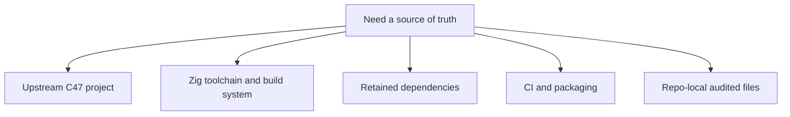

# Official References

This page groups the canonical external and repo-local references that back the
maintainer docs and the checked-in z47 workflow.

Prefer these exact surfaces over broad summaries or secondary writeups.

Audit basis: 2026-07-11, upstream pin `d1b643e7`, Zig `0.16.0` stable.

## Reference Map

```mermaid
flowchart TD
  A[Need a source of truth]
  B[Upstream C47 project]
  C[Zig toolchain and build system]
  D[Retained dependencies]
  E[CI and packaging]
  F[Repo-local audited files]

  A --> B
  A --> C
  A --> D
  A --> E
  A --> F
```

## Upstream Project Surfaces

- [C47 GitLab project](https://gitlab.com/rpncalculators/c43): authoritative
  upstream source repository consumed by z47. The path still uses the
  historical `c43` name even though the project identifies itself as C47.
- [README.md](../README.md): imported upstream project overview carried at the
  repo root.
- [BUILD.md](../BUILD.md): imported upstream build-target summary carried at
  the repo root.
- [Makefile](../Makefile): imported upstream human-facing command surface.
- [meson.build](../meson.build): imported upstream root build graph.
- [dep/meson.build](../dep/meson.build): imported upstream dependency build
  wiring.
- [src/c47/meson.build](../src/c47/meson.build): imported upstream main core
  build inputs.
- [src/c47-gtk/meson.build](../src/c47-gtk/meson.build): imported upstream GTK
  simulator build inputs.
- [src/c47-dmcp/meson.build](../src/c47-dmcp/meson.build): imported upstream
  DMCP build inputs.
- [src/c47-dmcp5/meson.build](../src/c47-dmcp5/meson.build): imported upstream
  DMCP5 build inputs.
- [docs/code/meson.build](../docs/code/meson.build): imported upstream code-doc
  build inputs.
- [subprojects/gmp-6.2.1.wrap](../subprojects/gmp-6.2.1.wrap): imported GMP wrap
  reference.

## Zig Toolchain And Build System

The pinned baseline is Zig `0.16.0` stable; the exact version, release date, and
checksum are recorded in [.github/zig-toolchain.env](../.github/zig-toolchain.env).

- [Zig download page](https://ziglang.org/download/): canonical release entry
  point.
- [Zig download index JSON](https://ziglang.org/download/index.json): canonical
  machine-readable release metadata used by the CI toolchain check.
- [Zig build system docs](https://ziglang.org/learn/build-system/): official
  build-system reference.
- [Zig C Translation CLI docs](https://ziglang.org/documentation/master/#C-Translation-CLI):
  official `translate-c` reference and limits.
- [Zig source repository](https://codeberg.org/ziglang/zig): canonical upstream
  Zig source tree.
- [ZIG-README.md](../ZIG-README.md): maintained z47 command and prerequisite
  summary.
- [CONTRIBUTING.md](../CONTRIBUTING.md): maintained contributor workflow and
  verification contract.
- [build.zig](../build.zig): live repo-root build router for this repository.

## Zig Idiom And Style Guidance (secondary)

There is no single official Zig style guide beyond `zig fmt` and the standard
library's naming conventions, so these are community/secondary sources. They are
the external basis for the idiom ratchet
([.github/project/report-idiom-status.py](../.github/project/report-idiom-status.py))
and for the code-quality assessment kept in the maintainer working notes.

Scope caveat (important, do not misread): z47 is a faithful C→Zig transliteration
pinned for byte-for-byte upstream parity, so the transliterated owner surface is
deliberately **non-idiomatic** and cannot satisfy most of these rules — see the
C-ABI ceiling in
[50-zig-c-boundaries-and-rewrite-policy.md](50-zig-c-boundaries-and-rewrite-policy.md).
Only the std-only pure-core modules under `zig_src/*` registered in
[build.zig](../build.zig) `pure_modules` follow this guidance fully. Treat these
as the yardstick the code is *measured against*, not a description of the whole
codebase.

- [Bun / oven-sh Zig style guide](https://github.com/oven-sh/style-guide):
  production-scale Zig conventions (const over var, slices `[]T` over
  pointer+length, named error sets, tagged unions over bool params, small
  functions, minimal `@as`/`@intCast`).
- [Zig naming conventions (Craddock)](https://nathancraddock.com/blog/zig-naming-conventions/):
  the camelCase-function / PascalCase-type / snake_case-variable conventions the
  owners follow.
- [Learning Zig: Style Guide](https://www.openmymind.net/learning_zig/style_guide/):
  community style reference.
- [zigcc/zig-idioms](https://github.com/zigcc/zig-idioms): common Zig idiom
  catalogue.
- [Zig memory-safety code-review checklist](https://pullpanda.io/blog/zig-code-review-checklist):
  the allocator / `errdefer` / bounds / optional / overflow checklist the pure
  cores are reviewed against.

## Retained Dependency References

z47 keeps these third-party surfaces as external or vendored C; none is a
Zig-native replacement (see
[50-zig-c-boundaries-and-rewrite-policy.md](50-zig-c-boundaries-and-rewrite-policy.md)).

- [GTK 3 docs](https://docs.gtk.org/gtk3/): canonical GTK 3 API and platform
  reference; retained external C library linked from Zig for the host simulator.
- [FreeType documentation](https://freetype.org/freetype2/docs/): canonical
  FreeType 2 reference; retained external C library linked from Zig (host).
- [GMP project page](https://gmplib.org/): canonical GMP project and release
  reference; retained external C library linked from Zig (host).
- [SwissMicros DMCP_SDK](https://github.com/swissmicros/DMCP_SDK): canonical
  DMCP hardware SDK repository (from upstream `.gitmodules`); retained external C
  input linked from Zig for DMCP firmware.
- [SwissMicros DMCP5_SDK](https://github.com/swissmicros/DMCP5_SDK): canonical
  DMCP5 hardware SDK repository (from upstream `.gitmodules`); retained external
  C input linked from Zig for DMCP5 firmware.
- PulseAudio: retained optional external host audio dependency, linked from Zig
  when present; no separate canonical doc surface is pinned here.
- The vendored `dep/decNumberICU` is compiled by Zig rather than linked as an
  external library; there is no external canonical doc surface to pin for it.

## Generator And Packaging Helper References

- [xlsxio repository](https://github.com/brechtsanders/xlsxio): build-time
  generator helper (`xlsxio_xlsx2csv` plus `libxlsxio_read`) used by the
  font-generator toolchain and its CI lanes; not a product-runtime dependency.
- [GitHub Actions workflow syntax](https://docs.github.com/actions/using-workflows/workflow-syntax-for-github-actions):
  workflow trigger, job, matrix, and artifact syntax reference.
- [GitHub Actions artifacts docs](https://docs.github.com/actions/using-workflows/storing-workflow-data-as-artifacts):
  artifact publishing and retention behavior.
- [GitHub Actions cache docs](https://docs.github.com/actions/using-workflows/caching-dependencies-to-speed-up-workflows):
  cache-key behavior used by the host-platform workflows.

## Repo-Local Governance And Pin Map

When a maintainer claim depends on the live repo state, inspect these checked-in
files before widening to external sources.

Pins and manifests:

- [.github/project/upstream-pin.env](../.github/project/upstream-pin.env):
  imported upstream commit, branch, and pin-updated date.
- [.github/zig-toolchain.env](../.github/zig-toolchain.env): pinned Zig stable
  version, release date, checksum, and the monitored Zig master snapshot.
- [.github/project/source-ownership.txt](../.github/project/source-ownership.txt):
  z47-owned versus imported-upstream surface manifest.
- [.github/project/upstream-port-ledger.tsv](../.github/project/upstream-port-ledger.tsv):
  per-surface port-state ledger.
- [.github/project/zig-c-boundaries.txt](../.github/project/zig-c-boundaries.txt):
  approved `@cImport`, `extern`, and generated-seam boundary manifest.
- [.github/project/idiom-status-baseline.json](../.github/project/idiom-status-baseline.json):
  idiomatic-Zig ratchet baseline.

Runbooks and gate scripts:

- [.github/project/upstream-resync-runbook.md](../.github/project/upstream-resync-runbook.md):
  the pin-advance (upstream resync) procedure.
- [.github/project/run-local-gate.sh](../.github/project/run-local-gate.sh):
  one command that reproduces the full Linux CI verdict before pushing.
- [.github/project/run-host-parity-battery.sh](../.github/project/run-host-parity-battery.sh):
  the host-parity build/test/oracle battery invoked by the local gate.
- [.github/project/check-portable-int-widths.sh](../.github/project/check-portable-int-widths.sh):
  portable integer-width governance guard.

Root entry points and CI workflows:

- [README.md](../README.md)
- [BUILD.md](../BUILD.md)
- [ZIG-README.md](../ZIG-README.md)
- [zig_docs/README.md](README.md)
- [build.zig](../build.zig)
- [.github/workflows/upstream-oracle.yml](../.github/workflows/upstream-oracle.yml)
- [.github/workflows/upstream-drift.yml](../.github/workflows/upstream-drift.yml)
- [.github/workflows/c-dependency-zero.yml](../.github/workflows/c-dependency-zero.yml)

## Reference Rules

- Prefer canonical repo-local files over paraphrases when the live checked-in
  state matters.
- Prefer official vendor docs over blogs or forum threads when a toolchain or
  dependency claim matters.
- Record uncertainty explicitly when a claim was not revalidated against the
  live file or the canonical external page.
