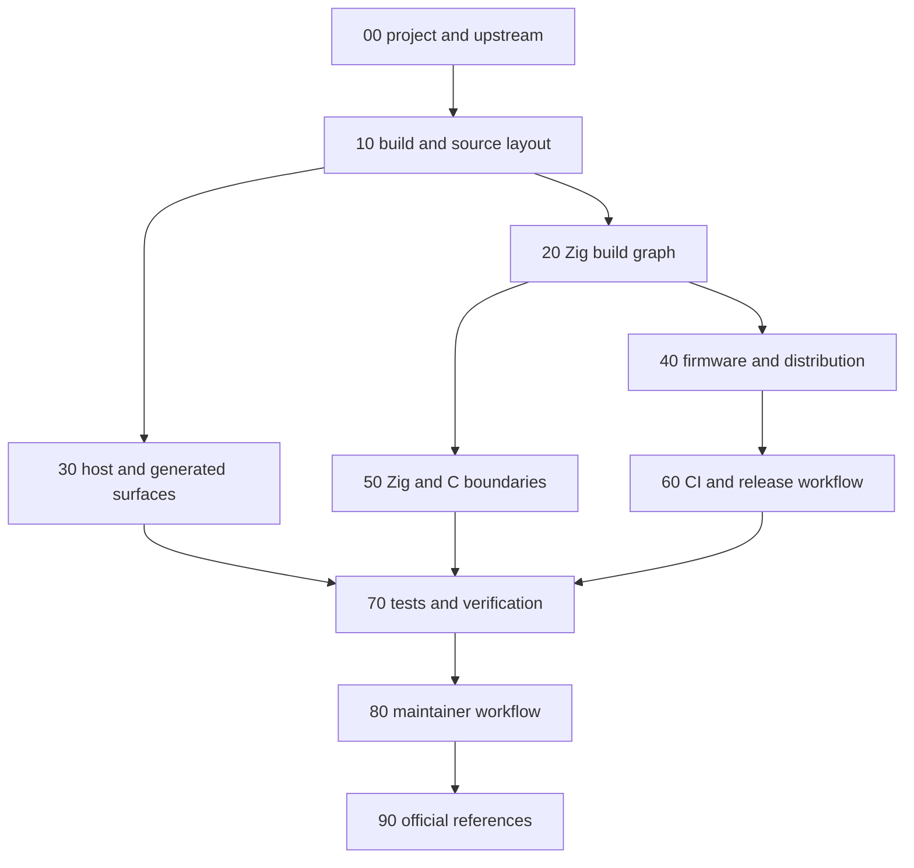

# z47 Development Docs

This directory is the maintained z47 developer-doc surface for the checked-in
Zig-first port workspace.

These pages are code-facing maintainer docs, not end-user usage docs.

The current live runtime Zig rewrites are intentionally narrow: short-integer
leaf logic, including the rotate or justify helpers, plus stack,
register-metadata, flags, memory,
program-serialization, calc-state, and keyboard-state ownership slices.

These pages document tracked, maintained repo surfaces only. They do not define
ignored local worktrees, ignored build outputs, or other ignored paths.

## Maintainer Doc Flow

## Read In Order

- [00-project-and-upstream.md](00-project-and-upstream.md): what z47 is, what
  the imported upstream C47 tree is, what the repo owns, and where the current
  port boundary sits
- [10-build-and-source-layout.md](10-build-and-source-layout.md): canonical
  build entrypoints, ownership layout, checked-in pins, outputs, and local
  maintainer flow
- [20-zig-build-graph.md](20-zig-build-graph.md): how `build.zig` routes work
  into the host, firmware, distribution, and rewrite domains
- [30-host-and-generated-surfaces.md](30-host-and-generated-surfaces.md): host
  simulator, generated artifacts, docs build, and retained host dependency
  contracts
- [40-firmware-and-distribution.md](40-firmware-and-distribution.md): DMCP and
  DMCP5 firmware targets, package variants, and host-package rules
- [50-zig-c-boundaries-and-rewrite-policy.md](50-zig-c-boundaries-and-rewrite-policy.md):
  current Zig rewrite slices, approved boundaries, and rules for adding new
  Zig or C seams
- [60-ci-and-release-workflow.md](60-ci-and-release-workflow.md): GitHub
  Actions lane split, artifacts, and local reproduction map
- [70-tests-and-verification.md](70-tests-and-verification.md): focused rerun
  lanes, generated-artifact checks, docs validation, and full Linux pre-CI
  sweep
- [80-maintainer-workflow.md](80-maintainer-workflow.md): how to keep the
  maintained doc set and root entrypoint docs aligned with the live repo
- [90-official-references.md](90-official-references.md): canonical upstream,
  Zig, dependency, and workflow references

## By Task

- build break, missing target, wrong output path, or stale build note:
  [10-build-and-source-layout.md](10-build-and-source-layout.md) and
  [20-zig-build-graph.md](20-zig-build-graph.md)
- host simulator, generated-artifact, or docs-build change:
  [30-host-and-generated-surfaces.md](30-host-and-generated-surfaces.md) and
  [70-tests-and-verification.md](70-tests-and-verification.md)
- firmware, DMCP package, or distribution change:
  [40-firmware-and-distribution.md](40-firmware-and-distribution.md),
  [60-ci-and-release-workflow.md](60-ci-and-release-workflow.md), and
  [70-tests-and-verification.md](70-tests-and-verification.md)
- Zig rewrite, `@cImport`, or direct `extern` boundary change:
  [50-zig-c-boundaries-and-rewrite-policy.md](50-zig-c-boundaries-and-rewrite-policy.md)
  and [70-tests-and-verification.md](70-tests-and-verification.md)
- CI lane, package artifact, or release-proof change:
  [60-ci-and-release-workflow.md](60-ci-and-release-workflow.md) and
  [70-tests-and-verification.md](70-tests-and-verification.md)
- maintainer-doc update workflow or page-routing change:
  [80-maintainer-workflow.md](80-maintainer-workflow.md)

## Maintainer Update Workflow

Use one promotion workflow when a non-trivial task changes build behavior,
rewrite status, CI routing, package identity, or verification rules.

1. Gather evidence from the live tracked files and commands before changing the
  maintained docs.
2. Keep exploratory notes and unsettled claims out of the maintained docs while
  the code or workflow is still moving.
3. After the implementation and focused validation settle, promote the stable
  contract changes into every affected `zig_docs/` page and the lightweight
  root entrypoints.
4. Re-run the smallest relevant validation lane after the final doc edit.

## Build Entry Points

Maintainer entrypoints:

- `zig build` or `zig build sim`: canonical host build entrypoint
- `zig build logical_shortint_parity`: focused parity lane for the live
  short-integer leaf rewrite slice
- `zig build rotate_bits_parity`: focused parity lane for the live rotate,
  justify, byte-swap, zip, and unzip leaf owner slice
- `zig build stack_state_parity`: focused parity lane for the live stack-state
  rewrite slice
- `zig build register_metadata_parity`: focused parity lane for the live
  register-metadata rewrite slice
- `zig build flags_parity`: focused parity lane for the live system-flag
  accessor rewrite slice
- `zig build memory_parity`: focused parity lane for the live memory rewrite
  slice
- `zig build program_serialization_parity`: focused parity lane for the live
  program-serialization rewrite slice
- `zig build calc_state_parity`: focused parity lane for the live calc-state
  rewrite slice
- `zig build math_command_wrappers_parity`: focused parity lane for the live
  math command-wrapper rewrite slice
- `zig build keyboard_state_parity`: focused parity lane for the live keyboard
  rewrite slice
- `zig build keyboard_statusbar_flags_regression`: focused regression lane for
  the current keyboard and flags interaction surface
- `zig build test`: canonical grouped host regression lane
- `zig build generated`: refreshes all tracked generated host artifacts
- `zig build docs`: canonical docs build for `docs/code`
- `zig build dmcp` or `zig build dmcp5`: canonical firmware entrypoints
- `zig build dist_linux`, `zig build dist_macos`, or `zig build dist_windows`:
  host-package entrypoints on the matching host OS

## Repo-Owned Automation Layout

- `build.zig` is the small repo-root router for options and top-level steps.
- `zig_build/` owns the host, firmware, distribution, and rewrite domains.
- `.github/` owns CI workflows, pins, and packaging or notice helpers.
- `zig_docs/` owns the maintained developer-doc set for the live repo.

If a change affects both the maintained doc set and one of the tracked build or
workflow contracts, update the affected docs and tracked source files in one
pass.